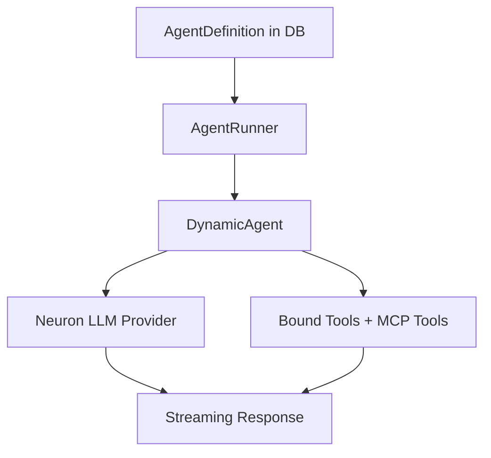

# Agents Overview

Agents are the core building blocks of NeuronAI Studio. Each agent definition stores a provider, model, system instructions, and optional tool/MCP bindings.

## What is an agent?

An agent is a configured LLM assistant that can:

- Follow a system prompt (instructions)
- Call bound tools during conversation
- Access MCP server tools when configured
- Run standalone in the Playground or inside workflow graphs

## Agent lifecycle

| Stage | Where | Guide |
|-------|-------|-------|
| Create / edit | Agent form | [Creating Agents](creating-agents.md) |
| Test | Playground | [Playground & Threads](playground-and-threads.md) |
| Evaluate | Evals UI or CLI | [Evaluations](evaluations.md) |
| Use in workflow | Agent node | [AI Nodes](../workflows/node-types/ai-nodes.md) |
| Export | CLI or future UI | [Export & Production](../export-and-production.md) |

## Studio routes

| Route | Purpose |
|-------|---------|
| `/neuronai-studio/agents` | List all agents |
| `/neuronai-studio/agents/create` | Create new agent |
| `/neuronai-studio/agents/{id}/edit` | Edit agent |
| `/neuronai-studio/agents/{id}/playground` | Test agent in chat |
| `/neuronai-studio/agents/{id}/evals` | Manage evaluation suites |

<!-- SCREENSHOT: agents-index -->
> **Screenshot pending:** Agent list with Create Agent button.
>
> Asset path: `docs/assets/screenshots/agents-index.png`
> Capture: `/neuronai-studio/agents` — dark theme, 1440×900

## Database model

Agents are stored in the `agent_definitions` table (prefix configurable). Key fields:

- `name`, `slug` — display name and unique identifier
- `provider`, `model` — LLM configuration
- `instructions` — system prompt
- `tools` — JSON array of tool binding references
- `memory_config` — reserved for future memory features

## Next steps

- [Creating Agents](creating-agents.md)
- [Playground & Threads](playground-and-threads.md)
- [Evaluations](evaluations.md)
- [Tools Overview](../tools/overview.md)
