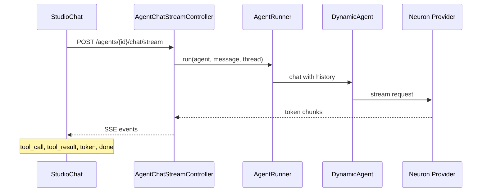

# Playground & Threads

The Playground is an interactive chat UI for testing agents. It supports streaming responses, tool-call visibility, persisted conversation threads, and optional file attachments.

## Open the Playground

From the agent list, click **Playground** on any agent:

```
/neuronai-studio/agents/{id}/playground
```

<!-- SCREENSHOT: agents-playground -->
> **Screenshot pending:** Agent Playground with streaming response and tool-call panel.
>
> Asset path: `docs/assets/screenshots/agents-playground.png`
> Capture: Playground with an active streaming response — dark theme, 1440×900


## Streaming architecture



Event types streamed to the browser:

| Event | Description |
|-------|-------------|
| `token` | Partial response text |
| `tool_call` | Agent invoked a tool |
| `tool_result` | Tool execution result |
| `error` | Runtime failure |
| `done` | Stream complete with finalized token and estimated-cost totals |

The Completed message shows total tokens and estimated cost. If an older stream payload has no usage fields, the message renders normally without usage chips.

## Conversation threads

Each agent playground session uses a UUID-based thread. Threads persist message history in the database.

<!-- SCREENSHOT: agents-thread-bar -->
> **Screenshot pending:** Thread selector with multiple conversation threads.
>
> Asset path: `docs/assets/screenshots/agents-thread-bar.png`
> Capture: Playground thread bar — dark theme, 1440×900


### Thread behavior

- **New thread** — starts a fresh conversation
- **Switch thread** — loads persisted history for that UUID
- **Context window** — older messages are trimmed (or compacted into a summary when summarization is enabled) based on the agent's `memory_config.context_window`, falling back to `chat_history_context_window` in config

Configure the global default context window:

```env
NEURONAI_STUDIO_CHAT_HISTORY_CONTEXT_WINDOW=150000
```

Optional dedicated summarizer model for compaction:

```env
NEURONAI_STUDIO_SUMMARIZER_PROVIDER=openai
NEURONAI_STUDIO_SUMMARIZER_MODEL=gpt-4o-mini
```

When unset, compaction uses the agent's own provider/model. Set the per-agent window/driver/summarization on the agent form (or override on an Agent node). Set this ~5–10% below your model's token limit to leave room for the system prompt and tool payloads.

## Workflow threads

Workflow runs use a similar persistence model with a per-trace thread ID stored in state as `__studio_thread_id`:

| Context | Thread scope | Loader |
|---------|--------------|--------|
| Playground | Per agent + user-selected UUID | `ChatThreadLoader` |
| Workflow harness | Per trace/run, stable across loop iterations | `AgentRunner` via `__studio_thread_id` |

When an **Agent** node executes inside a loop, subsequent iterations load prior messages for the same thread — enabling multi-turn qualification or refinement without manual state stitching.

Configure the same context window via `NEURONAI_STUDIO_CHAT_HISTORY_CONTEXT_WINDOW`; it applies to agent history loaded during workflow runs.

### Related code

- `ChatThreadLoader` — loads and trims history
- `StudioChatMessage` model — persisted messages
- `ChatThreadKey` — UUID scoping per agent

## Workflow test harness

Workflows use a similar chat UI (`StudioTestHarness`) but route through `WorkflowRunner` instead of `AgentRunner`. See [Runtime & Traces](../workflows/runtime-and-traces.md).

### Streaming parity

Agent and LLM nodes reach the same token-by-token experience as the playground. Enable **Stream tokens** on the node (default on for new Agent/LLM nodes in the harness) and the runner emits `token` SSE events between the node's step boundaries — `StudioChat` aggregates them into the assistant bubble exactly as in the playground. Structured output and tool-approval nodes fall back to the blocking path. See [Runtime & Traces → Token streaming](../workflows/runtime-and-traces.md#token-streaming).

## Next steps

- [Attachments](attachments.md) — send images, PDFs, and more
- [Creating Agents](creating-agents.md) — configure tools for richer playground sessions
- [Autonomous agents in workflows](../workflows/overview.md#autonomous-agents-in-workflows)
