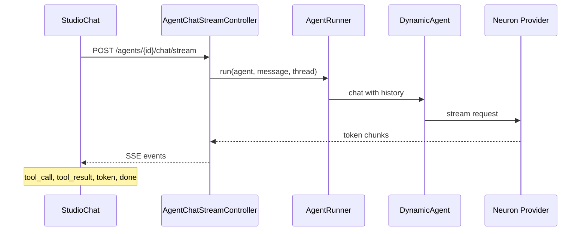

# Playground & Threads

The Playground is an interactive chat UI for testing agents. It supports streaming responses, tool-call visibility, persisted conversation threads, and optional file attachments.

## Open the Playground

From the agent list, click **Playground** on any agent:

```
/neuronai-studio/agents/{id}/playground
```

<!-- SCREENSHOT: agents-playground -->
> **Screenshot pending:** Agent Playground with streaming response and tool-call panel.
>
> Asset path: `docs/assets/screenshots/agents-playground.png`
> Capture: Playground with an active streaming response — dark theme, 1440×900


## Streaming architecture



Event types streamed to the browser:

| Event | Description |
|-------|-------------|
| `token` | Partial response text |
| `tool_call` | Agent invoked a tool |
| `tool_result` | Tool execution result |
| `error` | Runtime failure |
| `done` | Stream complete |

## Conversation threads

Each agent playground session uses a UUID-based thread. Threads persist message history in the database.

<!-- SCREENSHOT: agents-thread-bar -->
> **Screenshot pending:** Thread selector with multiple conversation threads.
>
> Asset path: `docs/assets/screenshots/agents-thread-bar.png`
> Capture: Playground thread bar — dark theme, 1440×900


### Thread behavior

- **New thread** — starts a fresh conversation
- **Switch thread** — loads persisted history for that UUID
- **Context window** — older messages are trimmed based on `chat_history_context_window` in config

Configure the context window:

```env
NEURONAI_STUDIO_CHAT_HISTORY_CONTEXT_WINDOW=150000
```

Set this ~5–10% below your model's token limit to leave room for the system prompt and tool payloads.

### Related code

- `ChatThreadLoader` — loads and trims history
- `StudioChatMessage` model — persisted messages
- `ChatThreadKey` — UUID scoping per agent

## Workflow test harness

Workflows use a similar chat UI (`StudioTestHarness`) but route through `WorkflowRunner` instead of `AgentRunner`. See [Runtime & Traces](../workflows/runtime-and-traces.md).

## Next steps

- [Attachments](attachments.md) — send images, PDFs, and more
- [Creating Agents](creating-agents.md) — configure tools for richer playground sessions
