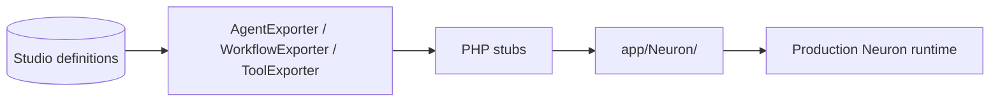

# Export & Production

Move from studio prototyping to production Neuron PHP classes. Export agents, workflows, and tools as typed classes ready for deployment.

## CodeGen feature flags

CodeGen is a **dev → production** step. Three config flags gate it (defaults `true` only when `APP_ENV=local`):

```php
'codegen' => [
    'enabled' => env('NEURONAI_STUDIO_CODEGEN_ENABLED', env('APP_ENV') === 'local'),
    'export' => env('NEURONAI_STUDIO_CODEGEN_EXPORT', env('APP_ENV') === 'local'),
    'preview' => env('NEURONAI_STUDIO_CODEGEN_PREVIEW', env('APP_ENV') === 'local'),
],
```

| Effective flag | Covers |
|----------------|--------|
| `enabled` (master) | Entry gate; `make-tool`; Import to Studio; prerequisite for children |
| `canExport` (`enabled && export`) | Disk writes (`AgentExporter`, `NativeWorkflowExporter`, `ToolExporter`); `neuronai-studio:export`; Export / Save & Export UI |
| `canPreview` (`enabled && preview`) | Code panel / generated preview (no disk write) |

Master off disables export and preview even if the child flags are `true`. Runtime registries and already-exported classes are **not** gated — production can keep running exported PHP with CodeGen off.

Example: preview in staging without writing files:

```env
NEURONAI_STUDIO_CODEGEN_ENABLED=true
NEURONAI_STUDIO_CODEGEN_EXPORT=false
NEURONAI_STUDIO_CODEGEN_PREVIEW=true
```

When export is off, tool builder still saves the DB definition and keeps any existing `class_path`.

## Export commands

```bash
php artisan neuronai-studio:export agent {id}
php artisan neuronai-studio:export workflow {id}
```

Tools are exported from the tool editor UI via **Export PHP** / **Save & Export Class** (uses `ToolExporter` internally). Commands fail with a clear error when `canExport` is false.

Output directory and namespace are configurable:

```env
NEURONAI_STUDIO_EXPORT_NAMESPACE=App\\Neuron
NEURONAI_STUDIO_EXPORT_PATH=app/Neuron
```

## Export flow



## Workflow code panel

The workflow editor includes a live **Code** panel showing the PHP class that would be generated (requires `canPreview`). The Export button requires `canExport`.

<!-- SCREENSHOT: workflows-code-panel -->
> **Screenshot pending:** PHP code preview panel in workflow editor.
>
> Asset path: `docs/assets/screenshots/workflows-code-panel.png`
> Capture: Workflow editor code panel — dark theme, 1440×900


## Import from PHP

Workflows defined as PHP classes implementing `StudioWorkflow` can be imported into the studio (requires `codegen.enabled`):

1. Place classes under `workflow_scan_paths` (default `app/Neuron`)
2. Open **Workflows** index → **Import to Studio**
3. Edit in the canvas or run from code

### StudioWorkflow contract

```php
interface StudioWorkflow
{
    public static function definition(): array;
}
```

Scanned by `WorkflowRegistry` and importable via `WorkflowClassImporter`.

## Import from JSON

Place JSON workflow files in `workflow_json_paths`:

```php
'workflow_json_paths' => [
    base_path('workflows'),
],
```

## Production checklist

| Step | Action |
|------|--------|
| 1 | Export agent/workflow classes (with CodeGen export enabled) |
| 2 | Review generated code in `app/Neuron/` |
| 3 | Register exported workflows in your app bootstrap if needed |
| 4 | Restrict webhook hosts and MCP allowlists |
| 5 | Configure production gate for studio access |
| 6 | Disable CodeGen flags (or leave local-only defaults) and/or protect `/neuronai-studio` routes |
| 7 | Enable async runs and run a queue worker when using background workflow execution |

### Workers

For long-running or production workflow execution outside the test harness SSE path:

```env
NEURONAI_STUDIO_ASYNC_RUNS_ENABLED=true
NEURONAI_STUDIO_QUEUE=workflows
```

Start a worker (adjust queue name and connection to match your config):

```bash
php artisan queue:work --queue=workflows
```

Clients dispatch runs via `POST /workflows/{id}/run`, poll `GET /workflows/traces/{id}/json`, and resume HITL via `POST /workflows/traces/{id}/resume`. See [Runtime & Traces](workflows/runtime-and-traces.md#queue-runner).

## CLI example

```bash
php artisan neuronai-studio:export agent 1
php artisan neuronai-studio:export workflow 2
```

Generated files:

```
app/Neuron/Agents/SupportAssistant.php
app/Neuron/Workflows/LeadQualification.php
```

## Related code

- `src/Codegen/CodegenGuard.php`
- `src/Codegen/AgentExporter.php`
- `src/Codegen/WorkflowExporter.php`
- `src/Codegen/ToolExporter.php`
- `src/Codegen/WorkflowClassImporter.php`
- `src/Registry/WorkflowRegistry.php`

## See also

- [Artisan Commands](../reference/artisan-commands.md)
- [Configuration](../reference/configuration.md#codegen-feature-flags)
- [Security & Access](security-and-access.md)
