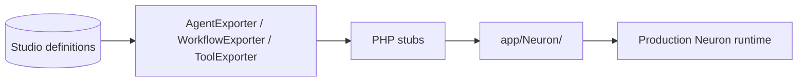

# Export & Production

Move from studio prototyping to production Neuron PHP classes. Export agents, workflows, and tools as typed classes ready for deployment.

## Export commands

```bash
php artisan neuronai-studio:export agent {id}
php artisan neuronai-studio:export workflow {id}
```

Tools are exported from the tool editor UI via **Export PHP** (uses `ToolExporter` internally).

Output directory and namespace are configurable:

```env
NEURONAI_STUDIO_EXPORT_NAMESPACE=App\\Neuron
NEURONAI_STUDIO_EXPORT_PATH=app/Neuron
```

## Export flow



## Workflow code panel

The workflow editor includes a live **Code** panel showing the PHP class that would be generated.

<!-- SCREENSHOT: workflows-code-panel -->
> **Screenshot pending:** PHP code preview panel in workflow editor.
>
> Asset path: `docs/assets/screenshots/workflows-code-panel.png`
> Capture: Workflow editor code panel — dark theme, 1440×900


## Import from PHP

Workflows defined as PHP classes implementing `StudioWorkflow` can be imported into the studio:

1. Place classes under `workflow_scan_paths` (default `app/Neuron`)
2. Open **Workflows** index → **Import to Studio**
3. Edit in the canvas or run from code

### StudioWorkflow contract

```php
interface StudioWorkflow
{
    public static function definition(): array;
}
```

Scanned by `WorkflowRegistry` and importable via `WorkflowClassImporter`.

## Import from JSON

Place JSON workflow files in `workflow_json_paths`:

```php
'workflow_json_paths' => [
    base_path('workflows'),
],
```

## Production checklist

| Step | Action |
|------|--------|
| 1 | Export agent/workflow classes |
| 2 | Review generated code in `app/Neuron/` |
| 3 | Register exported workflows in your app bootstrap if needed |
| 4 | Restrict webhook hosts and MCP allowlists |
| 5 | Configure production gate for studio access |
| 6 | Remove or protect `/neuronai-studio` routes in production |

## CLI example

```bash
php artisan neuronai-studio:export agent 1
php artisan neuronai-studio:export workflow 2
```

Generated files:

```
app/Neuron/Agents/SupportAssistant.php
app/Neuron/Workflows/LeadQualification.php
```

## Related code

- `src/Codegen/AgentExporter.php`
- `src/Codegen/WorkflowExporter.php`
- `src/Codegen/ToolExporter.php`
- `src/Codegen/WorkflowClassImporter.php`
- `src/Registry/WorkflowRegistry.php`

## See also

- [Artisan Commands](../reference/artisan-commands.md)
- [Security & Access](security-and-access.md)
