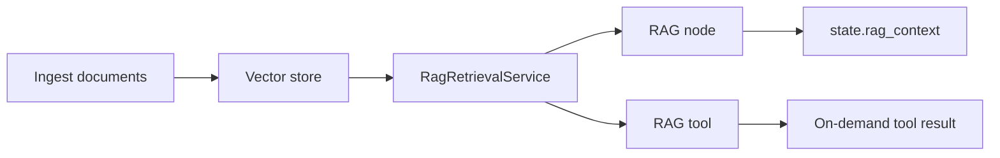

# Knowledge Bases Overview

Knowledge bases store embedded document chunks for semantic retrieval. NeuronAI Studio uses them in two ways:

1. **RAG workflow node** — retrieve once per run and inject context into downstream agent/LLM prompts
2. **RAG tool** (`KnowledgeBaseTool`) — let an agent call search on demand during a conversation

Studio does **not** use Neuron’s `RAG` agent subclass. Retrieval stays a separate service (`RagRetrievalService`) so the same knowledge base works in workflows and as an agent tool.

## When to use which pattern

| Pattern | Best for |
|---------|----------|
| [RAG node](retrieval.md) | Fixed “always ground this step” flows; template `rag-knowledge-qna` |
| [RAG tool](agent-binding.md) | Playground agents that decide when to search |

## Studio routes

| Route | Purpose |
|-------|---------|
| `/neuronai-studio/knowledge-bases` | List knowledge bases |
| `/neuronai-studio/knowledge-bases/create` | Create knowledge base |
| `/neuronai-studio/knowledge-bases/{id}/edit` | Edit, ingest, reindex, preview search |

## Next steps

- [Creating & ingest](creating-and-ingest.md)
- [Vector stores](vector-stores.md)
- [Retrieval & RAG node](retrieval.md)
- [Bind to agents](agent-binding.md)
