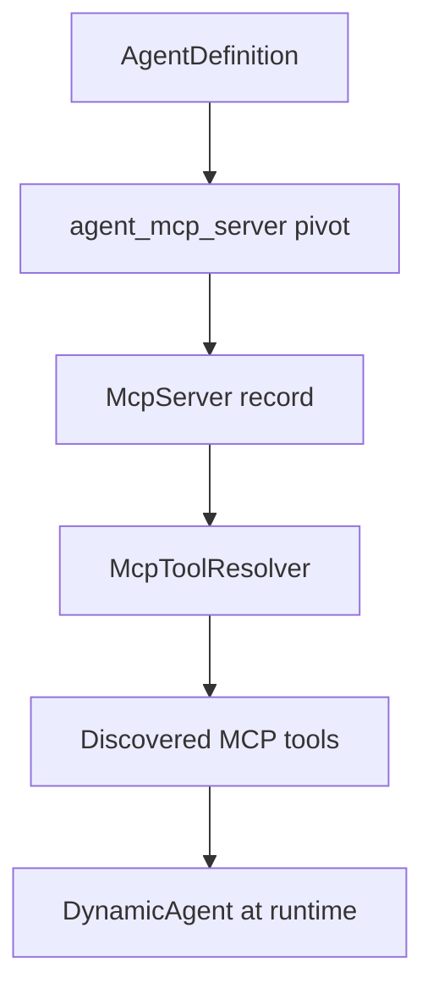

# MCP Agent Binding

Bind MCP servers to agents to expose their tools during Playground sessions and workflow agent nodes.

## Bind in the agent editor

1. Open an agent for editing
2. Add an MCP server binding
3. Optionally filter tools with **only** / **exclude** lists
4. Save



## Ref format

MCP tools use the ref pattern:

```
mcp:{server_key}:{tool_name}
```

Examples:

- `mcp:filesystem:read_file`
- `mcp:telescope:query_requests`

When binding an entire server, the agent receives all discovered tools (subject to only/exclude filters).

## Filter tools

Same as regular tool bindings:

```json
{
  "ref": "mcp:filesystem",
  "only": ["read_file", "list_directory"],
  "exclude": ["write_file"]
}
```

## Database schema

The `agent_mcp_server` pivot table links agents to MCP servers with optional filter JSON.

## Workflow usage

Agent nodes in workflows use agents with pre-configured MCP bindings. The **MCP node** can also call MCP tools directly without going through an agent. See [AI Nodes](../workflows/node-types/ai-nodes.md).

## Troubleshooting

| Issue | Check |
|-------|-------|
| Tools not appearing | Run Test Discovery in MCP editor |
| Stdio server fails | Command in allowlist? Process installed? |
| HTTP server fails | URL reachable? Token set in `.env`? |
| Timeout | Network latency, server startup time |

## Next steps

- [MCP Overview](overview.md)
- [Creating Agents](../agents/creating-agents.md)
