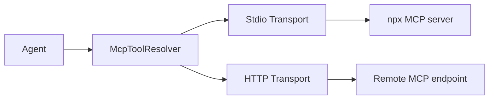

# MCP Servers Overview

[MCP (Model Context Protocol)](https://modelcontextprotocol.io) servers expose external tools and resources to agents. NeuronAI Studio lets you configure, test, and bind MCP connectors from the UI.

## What MCP adds

| Without MCP | With MCP |
|-------------|----------|
| Custom PHP/webhook tools only | Filesystem, databases, APIs via standard protocol |
| Manual integration per service | Reusable MCP server ecosystem |
| Studio-managed tool code | Remote tool discovery |



## Configuration sources

| Source | Where |
|--------|-------|
| Config presets | `config/neuronai-studio.php` → `mcp_servers` |
| Database records | Studio UI → MCP Servers |

Config presets appear in the UI as starting points. Database records support per-environment customization.

## Studio routes

| Route | Purpose |
|-------|---------|
| `/neuronai-studio/mcp-servers` | List MCP servers |
| `/neuronai-studio/mcp-servers/create` | Create server |
| `/neuronai-studio/mcp-servers/{id}/edit` | Edit and test discovery |

<!-- SCREENSHOT: mcp-servers-list -->
> **Screenshot pending:** MCP server index page.
>
> Asset path: `docs/assets/screenshots/mcp-servers-list.png`
> Capture: `/neuronai-studio/mcp-servers` — dark theme, 1440×900


## Bundled config presets

```php
'mcp_servers' => [
    'filesystem' => [
        'transport' => 'stdio',
        'command' => 'npx',
        'args' => ['-y', '@modelcontextprotocol/server-filesystem', storage_path('app')],
    ],
    'telescope' => [
        'transport' => 'http',
        'url' => env('TELESCOPE_MCP_URL', 'http://127.0.0.1:8000/telescope/mcp'),
    ],
],
```

## Security

- **Stdio allowlist** — restrict which commands can spawn MCP processes
- **HTTP tokens** — use `token_env` for authenticated endpoints

See [Stdio & HTTP](stdio-and-http.md) and [Security & Access](../security-and-access.md).

## Next steps

- [Stdio & HTTP](stdio-and-http.md)
- [Agent Binding](agent-binding.md)
