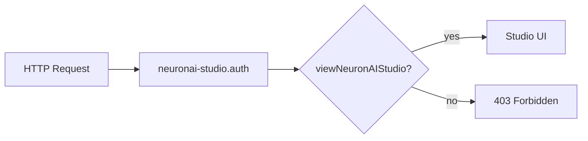

# Security & Access

NeuronAI Studio includes gate-based authorization, middleware protection, and security controls for webhook and MCP integrations.

## Authorization gate

All studio routes pass through the `neuronai-studio.auth` middleware, which checks the configured gate.

```php
// config/neuronai-studio.php
'gate' => 'viewNeuronAIStudio',
'middleware' => ['web', 'neuronai-studio.auth'],
```

### Default behavior

| Environment | Access |
|-------------|--------|
| `local` | Open to all (no auth required) |
| Other | Requires authenticated user |

### Custom gate

Define in `AppServiceProvider`:

```php
use Illuminate\Support\Facades\Gate;

Gate::define('viewNeuronAIStudio', function ($user) {
    return $user->hasRole('admin');
});
```



## Webhook security

Webhook tools validate target hosts against an allowlist:

```env
NEURONAI_STUDIO_WEBHOOK_ALLOWED_HOSTS=api.example.com,hooks.slack.com
```

Default `*` allows all hosts — **change this in production** to prevent SSRF.

Timeout limit:

```env
NEURONAI_STUDIO_WEBHOOK_TIMEOUT=15
```

## MCP security

### Stdio command allowlist

Only commands in the allowlist can spawn MCP processes:

```php
'mcp_stdio_allowlist' => ['npx', 'node', 'python', 'python3', 'uv', 'uvx'],
```

An empty array allows all commands.

### HTTP token auth

HTTP MCP servers use `token_env` to reference bearer tokens from `.env` — never hardcode secrets in config files.

## Production recommendations

| Control | Recommendation |
|---------|----------------|
| Studio access | Restrict gate to admin/developer roles |
| Environment | Disable open access outside `local` |
| Webhooks | Set explicit host allowlist |
| MCP stdio | Keep command allowlist minimal |
| Attachments | Use dedicated disk with size limits |
| API keys | Keep in `config/neuron.php` / `.env` only |

## File uploads

Attachment uploads respect:

- `max_size_kb` — default 10 MB
- `allowed_mimes` — restricted file types
- Laravel disk configuration

## Related code

- `EnsureNeuronAIStudioAuthorized` middleware
- `NeuronAIStudioServiceProvider::registerGate()`
- `WebhookTool` — host validation

## See also

- [Installation](../getting-started/installation.md#authorization)
- [Webhook Tools](tools/webhook-tools.md)
- [MCP Stdio & HTTP](mcp-servers/stdio-and-http.md)
