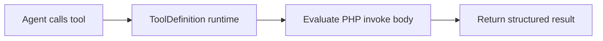

# Builder Tools

Builder tools let you define custom tool logic with a PHP invoke body and JSON input schema — no separate class file required for prototyping.

## Create a builder tool

1. Navigate to **Tools** → **Create Tool**
2. Define name, description, and input schema (JSON Schema)
3. Write the PHP invoke body
4. Save and test by binding to an agent

<!-- SCREENSHOT: tools-builder -->
> **Screenshot pending:** Tool builder with PHP invoke preview.
>
> Asset path: `docs/assets/screenshots/tools-builder.png`
> Capture: Tool edit page with builder form — dark theme, 1440×900


## How it works



At runtime, the studio wraps your invoke body in a dynamic Neuron `Tool` instance. The agent receives the tool name, description, and schema for LLM tool selection.

## Input schema

Define parameters as JSON Schema. Example:

```json
{
  "type": "object",
  "properties": {
    "city": {
      "type": "string",
      "description": "City name for weather lookup"
    }
  },
  "required": ["city"]
}
```

The LLM uses this schema to construct valid tool call arguments.

## Invoke body

The invoke body receives `$input` (decoded arguments) and should return a string or array:

```php
$city = $input['city'] ?? 'unknown';
return "Weather in {$city}: sunny, 22°C";
```

A live PHP preview in the editor helps validate syntax before saving.

## Production path

For production deployments, export the tool to a typed PHP class using **Export PHP** in the tool editor.

See [Registry & Codegen](registry-and-codegen.md) and [Make Tool CLI](make-tool-cli.md).

## Next steps

- [Webhook Tools](webhook-tools.md) — HTTP-based alternatives
- [Creating Agents](../agents/creating-agents.md) — bind tools to agents
