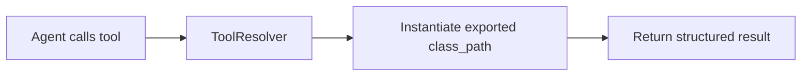

# Builder Tools

Builder tools let you prototype custom tool logic with a PHP invoke body and JSON input schema in the Studio UI — then export to a typed Neuron `Tool` class for execution.

> **Security:** Builder tools are for **local prototyping**. On export, Studio writes executable PHP under `export_path`. Keep `allow_builder_tools` and CodeGen export **off** outside `local`, and prefer [Make Tool CLI](make-tool-cli.md) / scanned classes or [Webhook Tools](webhook-tools.md) in production. See [Security & Access](../security-and-access.md#builder-tools).

## Create a builder tool

Requires `allow_builder_tools` (defaults to `true` only when `APP_ENV=local`).

1. Navigate to **Tools** → **Create Tool**
2. Define name, description, and input schema (JSON Schema)
3. Write the PHP invoke body
4. Save — with CodeGen export enabled, Studio also writes the class and sets `class_path`
5. Test by binding to an agent

<!-- SCREENSHOT: tools-builder -->
> **Screenshot pending:** Tool builder with PHP invoke preview.
>
> Asset path: `docs/assets/screenshots/tools-builder.png`
> Capture: Tool edit page with builder form — dark theme, 1440×900


## How it works


```mermaid
flowchart LR
    Agent[Agent calls tool] --> Runtime[ToolResolver]
    Runtime --> Class[Instantiate exported class_path]
    Class --> Result[Return structured result]
```

1. The invoke body is stored in `tool_definitions.config.invoke_body` (prefixed table, e.g. `neuronai_studio_tool_definitions`) for editing and preview.
2. **Export** (CodeGen) generates a PHP class under `export_path/Tools/` and stores `config.class_path`.
3. At runtime, `ToolResolver` instantiates that class — it does **not** `eval()` the database body.

Without a `class_path` (export never ran or CodeGen export is off), the tool **cannot** execute. Export before binding the tool in production-like environments.

## Input schema

Define parameters as JSON Schema. Example:

```json
{
  "type": "object",
  "properties": {
    "city": {
      "type": "string",
      "description": "City name for weather lookup"
    }
  },
  "required": ["city"]
}
```

The LLM uses this schema to construct valid tool call arguments.

## Invoke body

The invoke body receives `$input` (decoded arguments) and should return a string or array:

```php
$city = $input['city'] ?? 'unknown';
return "Weather in {$city}: sunny, 22°C";
```

A live PHP preview in the editor helps validate syntax before saving (requires CodeGen preview).

## Production path

For production deployments:

1. Keep `NEURONAI_STUDIO_ALLOW_BUILDER_TOOLS=false` (default outside `local`)
2. Export the tool to a typed PHP class (**Export PHP** / Save & Export), or create classes with [Make Tool CLI](make-tool-cli.md)
3. Prefer webhook tools when the logic lives in an external HTTP API

See [Registry & Codegen](registry-and-codegen.md), [Export & Production](../export-and-production.md), and [Security & Access](../security-and-access.md#builder-tools).

## Next steps

- [Webhook Tools](webhook-tools.md) — HTTP-based alternatives
- [Creating Agents](../agents/creating-agents.md) — bind tools to agents
