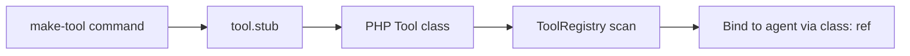

# Make Tool CLI

Generate a Neuron `Tool` PHP class scaffold from the command line.

## Command

```bash
php artisan neuronai-studio:make-tool {name}
```

Example:

```bash
php artisan neuronai-studio:make-tool WeatherLookup
```

Creates a tool class under your configured export path (default `app/Neuron/Tools/`).

## Generated structure

The command uses `ToolClassGenerator` with a stub template:

```
app/Neuron/Tools/WeatherLookup.php
```

The generated class extends Neuron's `Tool` base class with:

- Tool name and description placeholders
- `properties()` method for input schema
- `__invoke()` method for execution logic

## Workflow



1. Run `make-tool` to scaffold the class
2. Implement `__invoke()` with your logic
3. The class appears in the Tool Registry automatically
4. Bind to agents with ref `class:App\\Neuron\\Tools\\WeatherLookup`

## Export path configuration

```env
NEURONAI_STUDIO_EXPORT_NAMESPACE=App\\Neuron
NEURONAI_STUDIO_EXPORT_PATH=app/Neuron
```

## Alternative: builder tool first

For rapid prototyping, create a [Builder Tool](builder-tools.md) in the UI, test it in the Playground, then click **Export PHP** in the tool editor.

Both paths produce production-ready PHP classes.

## Next steps

- [Registry & Codegen](registry-and-codegen.md)
- [Export & Production](../export-and-production.md)
