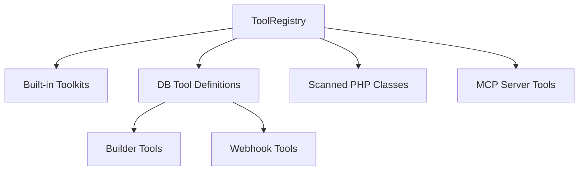

# Tools Overview

Tools extend agent capabilities beyond text generation. NeuronAI Studio supports two database-managed tool types plus built-in toolkits, scanned PHP classes, and MCP-exposed tools.

## Tool sources

| Source | Type | Created in |
|--------|------|------------|
| Built-in toolkits | Neuron `Toolkit` classes | `config/neuronai-studio.php` |
| Builder tools | PHP invoke body + JSON schema | Studio UI |
| Webhook tools | HTTP endpoint + JSON schema | Studio UI |
| RAG tools | Knowledge base search (`KnowledgeBaseTool`) | Studio UI (`?kind=rag`) |
| PHP classes | Neuron `Tool` subclasses | `app/Neuron/Tools/` or codegen |
| MCP tools | Remote MCP server | MCP server config |

## When to use each type

| Need | Tool type |
|------|-----------|
| Quick custom logic in PHP | [Builder Tool](builder-tools.md) |
| Call an external API | [Webhook Tool](webhook-tools.md) |
| Search a knowledge base on demand | [RAG tool](#rag-knowledge-base-tool) |
| Reusable production class | [Make Tool CLI](make-tool-cli.md) + export |
| Math, calendar, etc. | Built-in toolkit (`calculator`, `calendar`) |
| Filesystem, Telescope, etc. | [MCP Server](../mcp-servers/overview.md) |

## RAG knowledge base tool

Create a tool with type `rag` to let an agent call `RagRetrievalService` during chat:

1. **Tools** → Create → kind **RAG** (or `/tools/create?kind=rag`)
2. Select `knowledge_base_id` and optional `top_k` / `threshold`
3. Bind the tool on the agent

The LLM passes a `query` string; the tool returns source-prefixed chunks. For fixed graph retrieval (not on-demand), use a [RAG workflow node](../knowledge-bases/retrieval.md) instead.

Full guide: [Knowledge Bases — Agent binding](../knowledge-bases/agent-binding.md).

## Studio routes

| Route | Purpose |
|-------|---------|
| `/neuronai-studio/tools` | List database tools |
| `/neuronai-studio/tools/create` | Create builder tool |
| `/neuronai-studio/tools/create?kind=webhook` | Create webhook tool |
| `/neuronai-studio/tools/{id}/edit` | Edit tool |
| `/neuronai-studio/tools/{id}` | View tool details |
| `/neuronai-studio/tools/registry?ref=...` | Tool registry detail |

## Binding tools to agents

Tools are bound to agents by `ref` in the agent editor. See [Creating Agents](../agents/creating-agents.md#tool-bindings).

## Next steps

- [Builder Tools](builder-tools.md)
- [Webhook Tools](webhook-tools.md)
- [Registry & Codegen](registry-and-codegen.md)
