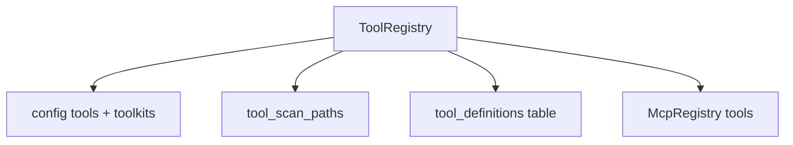

# Registry & Codegen

The Tool Registry is a unified catalog of every tool available in the studio — built-in toolkits, database tools, scanned PHP classes, and MCP-exposed tools.

## Browse the registry

From any tool binding UI or directly:

```
/neuronai-studio/tools/registry?ref=toolkit:calculator
```

<!-- SCREENSHOT: tools-registry -->
> **Screenshot pending:** Unified tool catalog.
>
> Asset path: `docs/assets/screenshots/tools-registry.png`
> Capture: Tool registry page — dark theme, 1440×900


## Registry sources



### Built-in toolkits

Registered in `config/neuronai-studio.php`:

```php
'tools' => [
    'calculator' => [
        'type' => 'toolkit',
        'class' => \NeuronAI\Tools\Toolkits\Calculator\CalculatorToolkit::class,
        'label' => 'Calculator',
    ],
],
```

Ref format: `toolkit:calculator`

### Scanned PHP classes

The registry scans `tool_scan_paths` for Neuron `Tool` subclasses:

```php
'tool_scan_paths' => [
    app_path('Neuron/Tools'),
],
```

Ref format: `class:App\\Neuron\\Tools\\MyTool`

### Database tools

Studio-created builder and webhook tools. Ref format: `db:{id}`

## Codegen: export to PHP

Export a database tool to a production PHP class from the tool editor via **Export PHP**.

The exporter uses `ToolExporter` and `ToolClassGenerator` to write a Neuron-compatible `Tool` class to your export path.

## Codegen: import from PHP

Place tool classes under `app/Neuron/Tools/`. They appear automatically in the registry after scanning.

Use `ToolClassImporter` programmatically to import a class into the database for studio editing.

## Related code

- `src/Registry/ToolRegistry.php`
- `src/Codegen/ToolExporter.php`
- `src/Codegen/ToolClassGenerator.php`
- `src/Codegen/ToolClassImporter.php`

## Next steps

- [Make Tool CLI](make-tool-cli.md)
- [Creating Agents](../agents/creating-agents.md)
