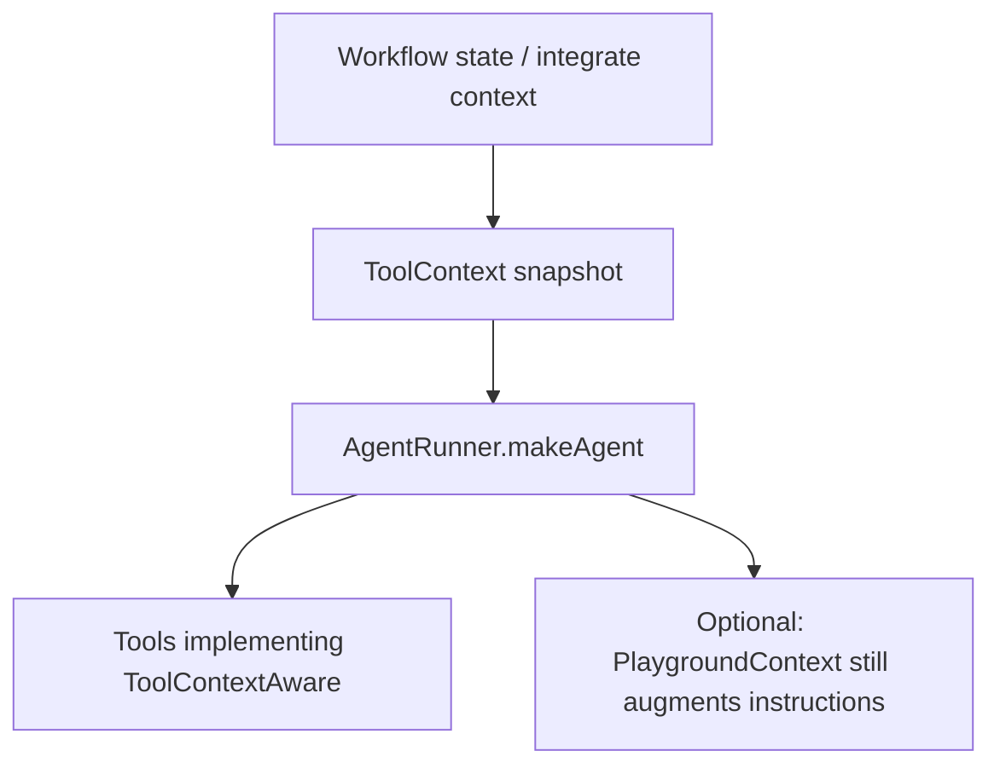

# Runtime ToolContext

Studio can inject a filtered **runtime state snapshot** into tools without adding LLM-facing tool properties. Use this for identity and integration fields the model must never invent or override (`account_id`, `user_id`, `session_id`, attachment metadata, and similar).

Neuron AI core does **not** inject `AgentState` into `Tool::execute()`. This is a Studio-layer feature.

## How it flows



| Source | How context is set |
|--------|--------------------|
| Workflow agent node | `AgentNodeExecutor` snapshots `WorkflowState` into `config.tool_context` |
| Agent integrate / playground | `payload.context` becomes `tool_context` **before** prompt augmentation |
| Nested `NodeAsTool` / `WorkflowAsTool` | Receive the same snapshot and forward it to child runs |

Internal keys (`__studio_*`, `__tool_runs`, …) are stripped from the snapshot.

## Opt-in tool API

```php
use DigitalElvis\NeuronAIStudio\Runtime\Tools\InteractsWithToolContext;
use DigitalElvis\NeuronAIStudio\Runtime\Tools\ToolContextAware;
use NeuronAI\Tools\PropertyType;
use NeuronAI\Tools\Tool;
use NeuronAI\Tools\ToolProperty;

class LookupPlanTool extends Tool implements ToolContextAware
{
    use InteractsWithToolContext;

    public function __construct()
    {
        parent::__construct(
            'lookup_plan',
            'Look up plan details for the authenticated contact in this conversation.',
        );
    }

    protected function properties(): array
    {
        // Only model-decided arguments — never account_id / user_id
        return [
            ToolProperty::make(
                name: 'question',
                type: PropertyType::STRING,
                description: 'What to look up about the plan',
                required: true,
            ),
        ];
    }

    public function __invoke(string $question): string
    {
        $accountId = $this->contextGet('integration_context.account_id');
        $planSlug = $this->contextGet('integration_context.plan_slug');
        $attachmentType = $this->contextGet('integration_context.attachment_type');

        return json_encode([
            'account_id' => $accountId,
            'plan_slug' => $planSlug,
            'attachment_type' => $attachmentType,
            'question' => $question,
        ], JSON_THROW_ON_ERROR);
    }
}
```

Helpers from `InteractsWithToolContext`:

- `setToolContext(ToolContext $context)` — called by the runtime
- `toolContext(): ?ToolContext`
- `contextGet(string $key, mixed $default = null)` — supports dot notation

Exported builder tools (codegen stub) implement `ToolContextAware` by default. Existing classes keep working without the interface.

## Calling with context

### Workflow

```php
app(WorkflowRunner::class)->run($workflow, [
    'message' => 'Quero saber sobre meu plano',
    'state' => [
        'integration_context' => [
            'channel' => 'chatwoot',
            'account_id' => 68,
            'user_id' => 13,
            'plan_slug' => 'cnh-protegida',
            'attachment_type' => null,
            // ...
        ],
        'include_history' => true,
    ],
]);
```

Agent nodes in that graph pass the filtered state into every `ToolContextAware` tool on the agent.

### Agent integrate / playground

```json
{
  "message": "Quero saber sobre meu plano",
  "context": {
    "integration_context": {
      "account_id": 68,
      "user_id": 13,
      "plan_slug": "cnh-protegida"
    },
    "include_history": true
  }
}
```

Tools receive `ToolContext`. Instructions are still augmented with the same JSON for the LLM (backward compatible). Prefer reading sensitive IDs from `ToolContext`, not from the prompt.

## Security contract

- Context is **never** merged into tool `properties()` / the schema sent to the provider.
- Tools that do not implement `ToolContextAware` are unchanged.
- Do not model `account_id`, `user_id`, or `session_id` as `ToolProperty` and “trust the model”.
- Snapshot is immutable at agent bootstrap (safe with parallel tool calls).

## Related

- [Tools overview](overview.md)
- [Workflow state](../workflows/state-and-conditions.md)
- [Stream adapters / integrate](../integration/stream-adapters.md)
