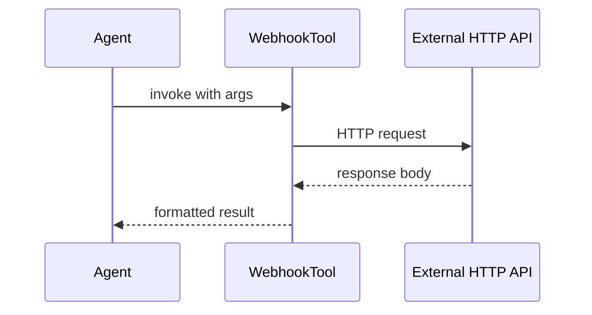

# Webhook Tools

Webhook tools call external HTTP endpoints when an agent invokes them. Define the URL, method, headers, and JSON input schema in the studio UI.

## Create a webhook tool

1. Navigate to **Tools** → **Create Tool** (webhook kind)
   ```
   /neuronai-studio/tools/create?kind=webhook
   ```
2. Configure endpoint URL, HTTP method, and optional headers
3. Define input schema
4. Save

<!-- SCREENSHOT: tools-webhook -->
> **Screenshot pending:** Webhook tool config with JSON schema editor.
>
> Asset path: `docs/assets/screenshots/tools-webhook.png`
> Capture: Webhook tool edit page — dark theme, 1440×900


## Request flow



## Security: host allowlist

Webhook tools validate the target host against `webhook_allowed_hosts` in config:

```env
NEURONAI_STUDIO_WEBHOOK_ALLOWED_HOSTS=api.example.com,hooks.slack.com
```

Default is `*` (allow all). **Restrict this in production** to prevent SSRF attacks from malicious tool configurations.

## Timeout

```env
NEURONAI_STUDIO_WEBHOOK_TIMEOUT=15
```

Requests exceeding this timeout (seconds) fail with an error returned to the agent.

## When to use webhooks vs builder tools

| Scenario | Recommendation |
|----------|----------------|
| Call existing REST API | Webhook tool |
| Complex PHP logic, DB access | Builder tool |
| Production-grade typed tool | Export to PHP class |

## Configuration reference

```php
'webhook_allowed_hosts' => env('NEURONAI_STUDIO_WEBHOOK_ALLOWED_HOSTS', '*'),
'webhook_timeout' => (int) env('NEURONAI_STUDIO_WEBHOOK_TIMEOUT', 15),
```

See [Security & Access](../security-and-access.md).

## Next steps

- [Builder Tools](builder-tools.md)
- [Registry & Codegen](registry-and-codegen.md)
