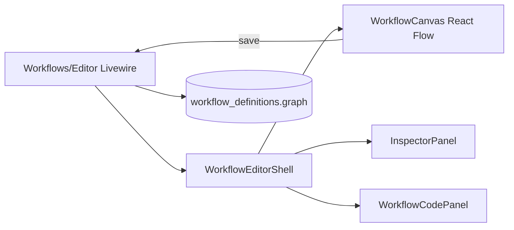

# Canvas Editor

The workflow canvas is a React Flow-based visual editor embedded in Livewire. Drag nodes, connect edges, configure via the inspector, and save validated graphs.

## Open the editor

```
/neuronai-studio/workflows/{id}/edit
```

<!-- SCREENSHOT: workflows-canvas -->
> **Screenshot pending:** Full workflow graph with node palette and inspector.
>
> Asset path: `docs/assets/screenshots/workflows-canvas.png`
> Capture: Workflow editor with a multi-node graph — dark theme, 1440×900


## Editor features

| Feature | Description |
|---------|-------------|
| **Node palette** | Drag node types onto the canvas |
| **Inspector panel** | Configure selected node fields |
| **Undo / redo** | Revert canvas changes |
| **Auto-layout** | Dagre-based graph layout |
| **Edge splicing** | Insert nodes between existing connections |
| **Validate** | Check graph structure before save |
| **Import / export JSON** | Copy graph JSON in/out |
| **Code panel** | Live PHP export preview |

## Architecture



React bundles communicate with Livewire via `window.Livewire` calls. See [Frontend Bundles](../../reference/frontend-bundles.md).

## Save and validate

Before saving, `GraphValidator` checks:

- Exactly one **Start** node
- At least one **Stop** node
- All nodes reachable from Start
- Valid edge connections (handle compatibility)

Fix validation errors shown in the UI before saving.

## JSON graph format

```json
{
  "version": 1,
  "nodes": [
    { "id": "start-1", "type": "start", "position": { "x": 0, "y": 0 }, "data": {} }
  ],
  "edges": [
    { "id": "e1", "source": "start-1", "target": "agent-1", "sourceHandle": "default", "targetHandle": "default" }
  ],
  "viewport": { "x": 0, "y": 0, "zoom": 1 }
}
```

## Preview mode

Read-only preview for code-sourced workflows:

```
/neuronai-studio/workflows/preview?class=App\Neuron\Workflows\MyWorkflow
```

## Next steps

- [Node types](node-types/flow-nodes.md)
- [State & Conditions](state-and-conditions.md)
- [Export & Production](../export-and-production.md)
