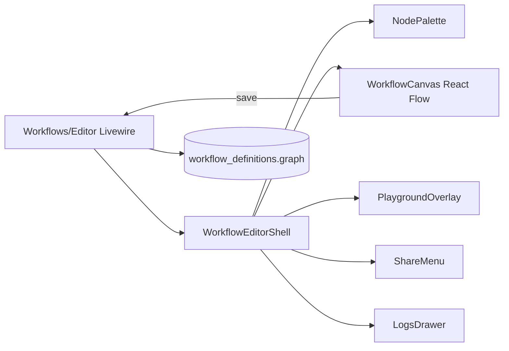

# Canvas Editor

The workflow canvas is a React Flow-based visual editor embedded in Livewire. Drag nodes, connect edges, configure forms on the node, and save validated graphs.

## Open the editor

```
/neuronai-studio/workflows/{id}/edit
```

<!-- SCREENSHOT: workflows-canvas -->
> **Screenshot pending:** Full workflow graph with searchable palette, floating Playground/Share, and expanded node forms.
>
> Asset path: `docs/assets/screenshots/workflows-canvas.png`
> Capture: Workflow editor with a multi-node graph — dark theme, 1440×900


## Editor features

| Feature | Description |
|---------|-------------|
| **Node palette** | Searchable, categorized drag-and-drop component list |
| **Inline node forms** | Selected nodes expand with configuration fields on the canvas |
| **Node toolbar** | Controls / Advanced / Collapse / Duplicate / Delete on selection |
| **Playground** | Floating top-right overlay to run and chat with the workflow |
| **Share** | Floating menu for Connect API, PHP export, and JSON |
| **Logs** | Bottom-left drawer for traces, live events, and validation |
| **Sticky notes** | Non-executable annotations stored in `graph.annotations` |
| **Zoom / lock / minimap** | Viewport controls with interactive lock |
| **Undo / redo** | Revert canvas changes |
| **Auto-layout** | Dagre-based graph layout |
| **Edge splicing** | Insert nodes between existing connections |
| **Validate** | Check graph structure before save |
| **Import / export JSON** | Copy graph JSON in/out |

## Architecture



React bundles communicate with Livewire via `window.Livewire` calls. See [Frontend Bundles](../../reference/frontend-bundles.md).

## Save and validate

Before saving, `GraphValidator` checks:

- Exactly one **Start** node
- At least one **Stop** node
- A control-flow path from Start to Stop (edges with `targetHandle: tools` are ignored for reachability and cycles)
- Valid edge connections (handle compatibility)
- Agent nodes: `agent_id` in existing mode, or `provider` + `model` in inline mode
- Tools binding edges: target must be an inline Agent; source must be Tool or MCP

Sticky notes (`type: note`) are ignored by validation and runtime; they persist under `annotations`.

Fix validation errors in the Logs drawer (Validation tab) before saving.

## Agent tools on the canvas

Inline Agent nodes expose a cyan **tools** handle. Connecting a Tool or MCP node to that handle attaches the tool as an agent binding (the model may call it during the Agent step). It does **not** run the Tool/MCP node as a separate sequential step unless that node is also on the Start→Stop control-flow path via `default` handles.

## JSON graph format

```json
{
  "version": 1,
  "nodes": [
    { "id": "start-1", "type": "start", "position": { "x": 0, "y": 0 }, "data": {} }
  ],
  "edges": [
    { "id": "e1", "source": "start-1", "target": "agent-1", "sourceHandle": "default", "targetHandle": "default" }
  ],
  "annotations": [
    { "id": "note_1", "type": "note", "position": { "x": 40, "y": 40 }, "data": { "text": "Pricing notes" } }
  ],
  "viewport": { "x": 0, "y": 0, "zoom": 1 }
}
```

## Keyboard shortcuts

| Shortcut | Action |
|----------|--------|
| `Delete` / `Backspace` | Remove selected node (not start/stop) |
| `⌘/Ctrl+D` | Duplicate selected node |
| `⌘/Ctrl+Z` | Undo |
| `⌘/Ctrl+Shift+Z` | Redo |
| `Escape` | Clear selection |

## Preview mode

Read-only preview for code-sourced workflows:

```
/neuronai-studio/workflows/preview?class=App\Neuron\Workflows\MyWorkflow
```

## Next steps

- [Node types](node-types/flow-nodes.md)
- [State & Conditions](state-and-conditions.md)
- [Export & Production](../export-and-production.md)
