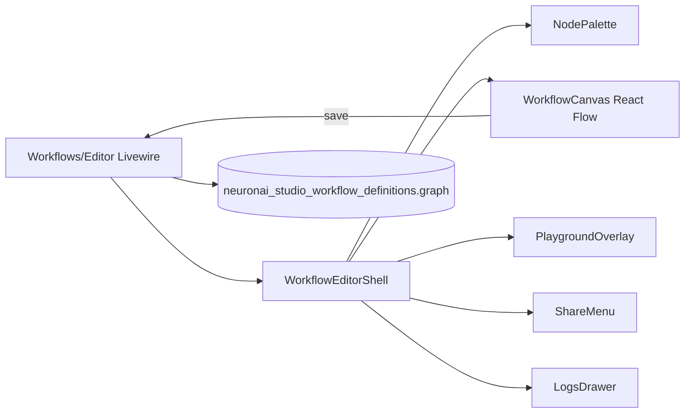

# Canvas Editor

The workflow canvas is a React Flow-based visual editor embedded in Livewire. Drag nodes, connect edges, configure forms on the node, and save validated graphs.

## Open the editor

```
/neuronai-studio/workflows/{id}/edit
```

<!-- SCREENSHOT: workflows-canvas -->
> **Screenshot pending:** Full workflow graph with searchable palette, floating Playground/Share, and expanded node forms.
>
> Asset path: `docs/assets/screenshots/workflows-canvas.png`
> Capture: Workflow editor with a multi-node graph — dark theme, 1440×900


## Editor features

| Feature | Description |
|---------|-------------|
| **Node palette** | Searchable, categorized drag-and-drop component list |
| **Tools / MCP catalogs** | Browse registry and MCP tools to attach bindings without leaving the canvas |
| **Inline node forms** | Selected nodes expand with configuration fields on the canvas |
| **Node toolbar** | Controls / Advanced / Collapse / Duplicate / Delete on selection |
| **Actions modal** | Configure Tool Mode `tool_exposure` (slug, description, `input` param) on specialists |
| **Playground** | Floating top-right overlay to run and chat with the workflow |
| **Share** | Floating menu for Connect API, PHP export, and JSON |
| **Logs** | Bottom-left drawer for traces, live events, and validation |
| **Sticky notes** | Non-executable annotations stored in `graph.annotations` |
| **Zoom / lock / minimap** | Viewport controls with interactive lock |
| **Undo / redo** | Revert canvas changes |
| **Auto-layout** | Dagre-based graph layout |
| **Edge splicing** | Insert nodes between existing connections |
| **Validate** | Check graph structure before save |
| **Import / export JSON** | Copy graph JSON in/out |

## Architecture


```mermaid
flowchart LR
    Livewire[Workflows/Editor Livewire] --> Shell[WorkflowEditorShell]
    Shell --> Palette[NodePalette]
    Shell --> Canvas[WorkflowCanvas React Flow]
    Shell --> Playground[PlaygroundOverlay]
    Shell --> Share[ShareMenu]
    Shell --> Logs[LogsDrawer]
    Canvas -->|save| Livewire
    Livewire --> DB[(neuronai_studio_workflow_definitions.graph)]
```

React bundles communicate with Livewire via `window.Livewire` calls. See [Frontend Bundles](../../reference/frontend-bundles.md).

## Save and validate

Before saving, `GraphValidator` checks:

- Exactly one **Start** node
- At least one **Stop** node
- A control-flow path from Start to Stop (edges with `targetHandle: tools` are ignored for reachability and cycles)
- Valid edge connections (handle compatibility)
- Agent nodes: `agent_id` in existing mode, or `provider` + `model` in inline mode
- Tools binding edges: target must be an inline Agent; source must be Tool or MCP

Sticky notes (`type: note`) are ignored by validation and runtime; they persist under `annotations`.

Fix validation errors in the Logs drawer (Validation tab) before saving.

## Agent tools on the canvas

Agent nodes expose a cyan **tools** handle in both inline and existing modes. Attach tools by:

- Connecting a **Tool** or **MCP** node to the **tools** handle
- Picking entries from the **Tools** / **MCP** catalogs on the canvas (same registry refs as the agent editor)

Canvas bindings merge with tools already defined on the agent definition. A Tool/MCP node on a **tools** edge is a binding only — it does **not** run as a sequential step unless that node is also on the Start→Stop path via `default` handles.

### Tool Mode / Toolset

Enable **Tool Mode** on a toolable **Agent** or **Run Workflow** node to turn it into a specialist/tool. The node shows an amber **toolset** source handle instead of control-flow Response. Use the **Actions** modal to set `tool_exposure` (slug, description, caller-controlled `input`). Wire:

```text
specialist (toolset) → supervisor (tools)
run_workflow Tool Mode (toolset) → supervisor (tools)
```

Control-flow stays `Start → supervisor → Stop`. Agents resolve via `NodeAsTool`; Run Workflow Tool Mode resolves via `WorkflowAsTool`. See [AI nodes → Tool Mode](node-types/ai-nodes.md#tool-mode-agent-as-tool) and [Logic nodes → Run Workflow](node-types/logic-nodes.md#run-workflow).

## JSON graph format

```json
{
  "version": 1,
  "nodes": [
    { "id": "start-1", "type": "start", "position": { "x": 0, "y": 0 }, "data": {} }
  ],
  "edges": [
    { "id": "e1", "source": "start-1", "target": "agent-1", "sourceHandle": "default", "targetHandle": "default" }
  ],
  "annotations": [
    { "id": "note_1", "type": "note", "position": { "x": 40, "y": 40 }, "data": { "text": "Pricing notes" } }
  ],
  "viewport": { "x": 0, "y": 0, "zoom": 1 }
}
```

## Keyboard shortcuts

| Shortcut | Action |
|----------|--------|
| `Delete` / `Backspace` | Remove selected node (not start/stop) |
| `⌘/Ctrl+D` | Duplicate selected node |
| `⌘/Ctrl+Z` | Undo |
| `⌘/Ctrl+Shift+Z` | Redo |
| `Escape` | Clear selection |

## Node names

Each executable node can have an optional **node name** (`title` in graph JSON). The graph **`id` stays immutable** — edges, tool bindings, checkpoints, and traces keep using it.

| Surface | Shows |
|---------|--------|
| Canvas card | Node name (or type label when untitled) |
| Inspector header | Editable node name (Dify-style) |
| Logs / traces / playground | Node name when set; otherwise `node_id` |
| Variable picker | Node name as the source group label |
| Native PHP export | Class/event names from a slug of the title; `STUDIO_NODE_ID` remains the graph `id` |

**Authoring rules**

- Clearing the inspector name field on blur **does not** wipe the previous name — it reverts.
- Names must be **unique per workflow** (case-insensitive). Duplicate export slugs block save/validate.
- New drops default to the type label (`Agent`, `Agent 2`, …). Duplicates get `{name} 2`, etc.
- Legacy graphs without `title` are unchanged until you commit a name (no automatic backfill).

## Preview mode

Read-only preview for code-sourced workflows:

```
/neuronai-studio/workflows/preview?class=App\Neuron\Workflows\MyWorkflow
```

## Next steps

- [Node types](node-types/flow-nodes.md)
- [State & Conditions](state-and-conditions.md)
- [Export & Production](../export-and-production.md)
