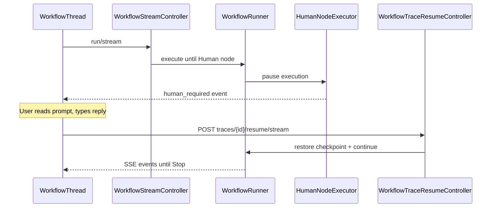
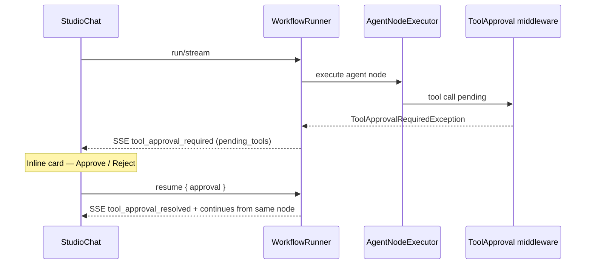
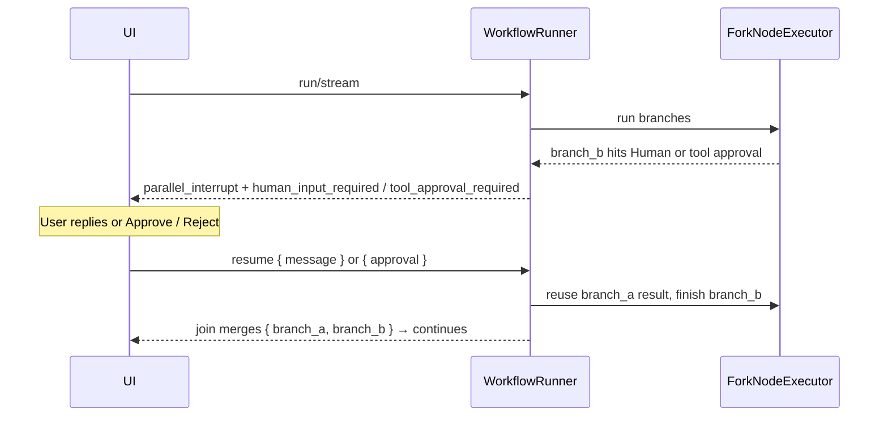

# Human-in-the-Loop

Human-in-the-Loop (HITL) pauses workflow execution at a **Human** node, waits for user input, then resumes from a saved checkpoint.

## When to use HITL

| Scenario | Example |
|----------|---------|
| Approval gates | Agent drafts response → human approves → send |
| Missing information | Agent needs data only a human can provide |
| Quality review | Classify intent → human verifies → route |

The bundled `support-rag-hitl` template demonstrates a full HITL flow. For **tool approval inside a parallel fork**, use `parallel-refund-approval` (eligibility LLM + approval-gated refund agent).

## How it works



## Human node configuration

| Field | Description |
|-------|-------------|
| `prompt` | Message displayed to the user in the test harness |
| `output_key` | State key where the reply is stored (default: `human_response`) |

Downstream nodes reference the reply with `{{human_response}}` in templates.

When a Human node is visited again inside a **loop**, the previous reply does not auto-complete the node — each visit pauses for fresh input. Resume injects a one-shot passthrough so parallel/native re-entry still works.

## Resume flow

1. Workflow reaches a Human node
2. UI shows the prompt and an input field
3. User submits a reply
4. `POST /neuronai-studio/traces/{id}/resume/stream` restores the checkpoint
5. Reply is written to `output_key` in state
6. Execution continues to the next node

<!-- SCREENSHOT: workflows-hitl -->
> **Screenshot pending:** Paused human node with resume UI.
>
> Asset path: `docs/assets/screenshots/workflows-hitl.png`
> Capture: Workflow test harness paused at Human node — dark theme, 1440×900


## Tool approval

Tool approval is a HITL variant scoped to **agent tool calls** rather than a dedicated Human node. When an Agent node has approval enabled, the workflow pauses right before a tool runs and waits for a human to approve or reject it.

### Tool approval vs Human node

| Aspect | Human node | Tool approval |
|--------|-----------|---------------|
| Trigger | Graph reaches a `human` node | Agent node's model requests a tool |
| Trace status | `awaiting_input` | `awaiting_tool_approval` |
| SSE event | `human_input_required` | `tool_approval_required` |
| Resume input | Free-text reply (`message`) | Decision (`approval: approve\|reject`) + optional feedback |
| UI | Composer text reply | Inline **Approve / Reject** card (no modal) |
| Reject routing | n/a | Optional `rejected` handle on the agent node |

### Enabling it

Turn on **Require tool approval** on the [Agent definition](../agents/creating-agents.md#tool-approval), or override it per node with `require_tool_approval` in the agent node data. See [AI Nodes](node-types/ai-nodes.md#tool-approval) for node configuration.

### Flow



In the test harness, the pending tools and their arguments render in an inline `ToolApprovalCard`. Approving runs the tool and continues; rejecting skips it (optionally routing to the `rejected` handle) and forwards your feedback to the agent.

> **Serialization note:** the paused agent's interrupt is serialized into the checkpoint, so Studio tools should be **class-based**. Tools built with inline `Closure` callbacks cannot be serialized across the pause.

See [Runtime & Traces](runtime-and-traces.md#tool-approval-pause-awaiting_tool_approval) for the checkpoint shape and resume payload.

## Parallel branches

A Human node or an **approval-gated Agent** can live **inside a parallel branch** (see
[Fork/Join](node-types/logic-nodes.md#fork)). When a branch pauses, the runner:

1. Emits `parallel_interrupt` (`fork_id`, `branch_id`, `node_id`, `reason`) followed by
   either `human_input_required` or `tool_approval_required` (with `branch_id`), and sets
   the trace to `awaiting_input` or `awaiting_tool_approval` respectively.
2. Persists a **parallel checkpoint** (`kind: parallel`) that records the results of
   branches that already completed, the interrupted branch's pending state (including the
   serialized tool interrupt when applicable), and which branches have not started yet.

On resume, execution continues **only the interrupted branch** from its Human node or
agent approval, re-runs any branches that had not started, and reuses the already-completed
branch results — then the Join node merges everything. Multiple branches can pause in turn
(human and/or tool approval); each resume advances one. Sequential and concurrent
(`parallel.concurrency`) schedulers share the same pause/resume semantics.



Resume payloads must match the pause reason: a tool-approval pause rejects a free-text
`message` without `approval=approve|reject`. Tool interrupts still require **class-based**
tools so the serialized `WorkflowInterrupt` can be restored across the pause.

## Checkpoint storage

Checkpoints are stored on the trace record. The runtime uses `HumanInputRequiredException` to signal the pause without marking the trace as failed. Tool approval uses `ToolApprovalRequiredException` and the `awaiting_tool_approval` status, and parallel branch pauses use `ParallelBranchInterruptException` with a `kind: parallel` checkpoint.

Separately, individual expensive nodes can cache their result across resumes via opt-in
**node checkpoints** (`data.checkpoint: true`), persisted in the
`neuronai_studio_workflow_checkpoints` table. See
[Runtime & Traces](runtime-and-traces.md#node-checkpoints).

## Template example

Install the **Support RAG HITL** template from [Templates](../templates.md):

```
support-rag-hitl
```

This workflow combines intent classification, RAG retrieval, and human approval before sending a response.

For **tool approval inside a parallel branch**, install **Parallel Refund Approval**:

```
parallel-refund-approval
```

One fork branch runs an LLM eligibility check; the other runs `refund-actions-agent` with `require_tool_approval` and the class-based `IssueRefundTool`. Approve in the harness to continue past `awaiting_tool_approval`, then join + compose.

## Related code

- `HumanNodeExecutor`
- `HumanInputRequiredException`
- `ToolApprovalRequiredException`, `AgentNodeExecutor`, `AgentRunner`
- `ParallelBranchInterruptException`, `ForkNodeExecutor`, `ParallelBranchRunner`
- `CheckpointService`, `WorkflowCheckpoint`
- `WorkflowTraceResumeController`
- `WorkflowThread.jsx`, `ToolApprovalCard.jsx` (resume UI)

## See also

- [Flow Nodes](node-types/flow-nodes.md)
- [Runtime & Traces](runtime-and-traces.md)
