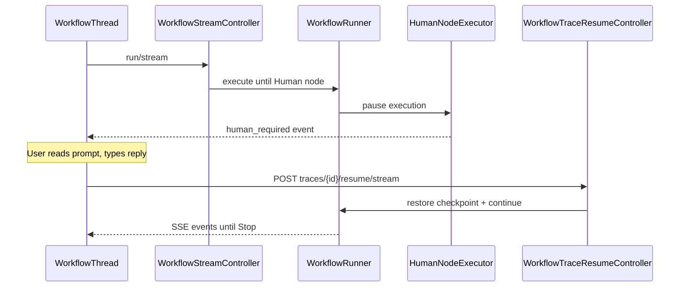

# Human-in-the-Loop

Human-in-the-Loop (HITL) pauses workflow execution at a **Human** node, waits for user input, then resumes from a saved checkpoint.

## When to use HITL

| Scenario | Example |
|----------|---------|
| Approval gates | Agent drafts response → human approves → send |
| Missing information | Agent needs data only a human can provide |
| Quality review | Classify intent → human verifies → route |

The bundled `support-rag-hitl` template demonstrates a full HITL flow.

## How it works



## Human node configuration

| Field | Description |
|-------|-------------|
| `prompt` | Message displayed to the user in the test harness |
| `output_key` | State key where the reply is stored (default: `human_response`) |

Downstream nodes reference the reply with `{{human_response}}` in templates.

## Resume flow

1. Workflow reaches a Human node
2. UI shows the prompt and an input field
3. User submits a reply
4. `POST /neuronai-studio/traces/{id}/resume/stream` restores the checkpoint
5. Reply is written to `output_key` in state
6. Execution continues to the next node

<!-- SCREENSHOT: workflows-hitl -->
> **Screenshot pending:** Paused human node with resume UI.
>
> Asset path: `docs/assets/screenshots/workflows-hitl.png`
> Capture: Workflow test harness paused at Human node — dark theme, 1440×900


## Checkpoint storage

Checkpoints are stored on the trace record. The runtime uses `HumanInputRequiredException` to signal the pause without marking the trace as failed.

## Template example

Install the **Support RAG HITL** template from [Templates](../templates.md):

```
support-rag-hitl
```

This workflow combines intent classification, RAG retrieval, and human approval before sending a response.

## Related code

- `HumanNodeExecutor`
- `HumanInputRequiredException`
- `WorkflowTraceResumeController`
- `WorkflowThread.jsx` (resume UI)

## See also

- [Flow Nodes](node-types/flow-nodes.md)
- [Runtime & Traces](runtime-and-traces.md)
