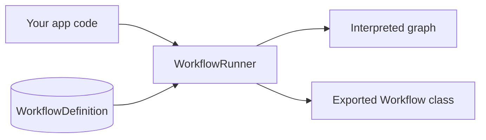

# Invoking Workflows from PHP

Create workflows on the canvas (or from templates), then execute them from Laravel via `WorkflowRunner`. Always go through the runner — even exported native workflow classes are selected by `WorkflowDefinition.class_path` and executed by `WorkflowRunner`.



## Choose an API

| Method | Use when |
|--------|----------|
| `run()` | Sync execution; optional SSE-style emitter callback |
| `dispatch()` | Queue a run (`async_runs_enabled` must be on) |
| `resume()` | Continue after Human / tool-approval pause |
| `dispatchResume()` | Queue a resume |
| `runExistingRun()` | Execute a `StudioRun` already in `queued` / `running` |

HTTP harness and integrate adapters call the same runner — see [Runtime & Traces](runtime-and-traces.md) and [Stream Adapters](../integration/stream-adapters.md).

## Simple sync run

```php
use DigitalElvis\NeuronAIStudio\Models\WorkflowDefinition;
use DigitalElvis\NeuronAIStudio\Runtime\WorkflowRunner;

$workflow = WorkflowDefinition::query()->where('slug', 'basic-agent-chat')->firstOrFail();

$run = app(WorkflowRunner::class)->run($workflow, [
    'input' => 'Hello from my app', // or 'message' => '…'
]);

// $run->status — completed | failed | awaiting_input | awaiting_tool_approval | …
// $run->output — final state snapshot (array)
```

`message` and `input` both seed state key `input` (`message` wins if both are set).

## With state (context)

Merge arbitrary keys into the initial workflow state. Agent nodes snapshot this into `ToolContext` for tools that implement `ToolContextAware`.

```php
$run = app(WorkflowRunner::class)->run($workflow, [
    'message' => 'What is my plan?',
    'state' => [
        'customer_id' => 'cust-123',
        'integration_context' => [
            'channel' => 'api',
            'account_id' => 68,
            'user_id' => 13,
            'plan_slug' => 'gold',
        ],
    ],
]);
```

See [Runtime ToolContext](../tools/runtime-tool-context.md) and [State & Conditions](state-and-conditions.md).

## With thread memory

Pass a stable `thread_id` so Agent nodes reuse the same chat history (stored as `__studio_thread_id` on state):

```php
use Illuminate\Support\Str;

$threadId = (string) Str::uuid(); // persist per conversation

$run = app(WorkflowRunner::class)->run($workflow, [
    'message' => 'My name is Alex.',
    'thread_id' => $threadId,
]);

// Later request — same workflow + thread_id
$run = app(WorkflowRunner::class)->run($workflow, [
    'message' => 'What is my name?',
    'thread_id' => $threadId,
]);
```

Inside a single run with a **Loop**, the runner keeps one `__studio_thread_id` across iterations automatically. See [Quickstart: Conversation Memory](../../getting-started/quickstart-conversation-memory.md).

## With attachments

```php
$run = app(WorkflowRunner::class)->run($workflow, [
    'message' => 'Qualify this lead from the attached notes',
    'attachments' => [
        [
            'type' => 'document',
            'mime_type' => 'text/plain',
            'storage_key' => 'neuronai-studio/attachments/notes.txt',
            'name' => 'notes.txt',
        ],
    ],
]);
```

Attachments land in `state.attachments` and survive loop iterations until the run finishes. MIME allowlist: [Attachments](../agents/attachments.md).

## Streaming events (emitter)

```php
$run = app(WorkflowRunner::class)->run(
    $workflow,
    ['message' => 'Start triage'],
    function (string $event, array $data): void {
        // step_started, token, tool_call, tool_result,
        // human_input_required, trace_completed, …
        logger()->debug('workflow.sse', compact('event', 'data'));
    },
);
```

Event catalog: [Runtime & Traces](runtime-and-traces.md).

## Human-in-the-loop resume

```php
$run = app(WorkflowRunner::class)->run($workflow, [
    'message' => 'I need help with order status',
]);

if ($run->status === 'awaiting_input') {
    $run = app(WorkflowRunner::class)->resume(
        $run,
        (string) $run->awaiting_node_id,
        'order-42',
        attachments: [
            // optional extra files on resume
        ],
    );
}

if ($run->status === 'awaiting_tool_approval') {
    $run = app(WorkflowRunner::class)->resume(
        $run,
        (string) $run->awaiting_node_id,
        'Looks safe',
        approval: 'approve', // or 'reject'
    );
}
```

Full HITL patterns: [Human-in-the-Loop](human-in-the-loop.md).

## Async (queue)

```env
NEURONAI_STUDIO_ASYNC_RUNS_ENABLED=true
```

```php
$run = app(WorkflowRunner::class)->dispatch($workflow, [
    'message' => 'Long-running triage',
    'state' => ['priority' => 'high'],
]);

// Later, after awaiting_input:
app(WorkflowRunner::class)->dispatchResume(
    $run,
    (string) $run->awaiting_node_id,
    'user reply',
);
```

Run a queue worker for `neuronai-studio` jobs. See [Export & Production → Workers](../export-and-production.md#workers).

## Input contract summary

| Input key | Effect |
|-----------|--------|
| `message` / `input` | Seeds state `input` |
| `state` | Merged into initial workflow state |
| `thread_id` | Stable conversation thread for Agent nodes |
| `attachments` | Copied to `state.attachments` |
| `__parent_run_id` | Nesting parent (or pass `parentRun:` to `run()`) |
| `__workflow_nesting_depth` | Nesting depth stamp (max 3) |

Integrate HTTP may alias `context` → `state`. Prefer `state` in PHP.

## Exported workflow classes

```bash
php artisan neuronai-studio:export workflow {id}
```

Export writes a Neuron `Workflow` under `app/Neuron/` and links `WorkflowDefinition.class_path`. Host code still resolves the definition and calls `WorkflowRunner::run()` — the runner switches to native execution when `class_path` points at a valid exported class.

Do not bypass the runner by instantiating the exported class for Studio-compatible runs (traces, HITL, threads, nesting).

## Related

- [Workflows Overview](overview.md)
- [Runtime & Traces](runtime-and-traces.md)
- [State & Conditions](state-and-conditions.md)
- [Human-in-the-Loop](human-in-the-loop.md)
- [Invoking Agents](../agents/invoking-agents.md)
- [Export & Production](../export-and-production.md)
