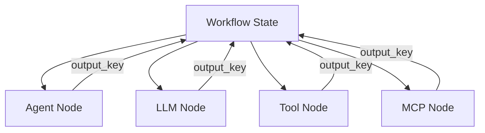

# AI Nodes

AI nodes invoke language models, agents, tools, and MCP connectors within a workflow graph.

## Agent

**Purpose:** Run a configured studio agent with a templated message.

| Config | Description |
|--------|-------------|
| `agent_id` | Database ID of the agent |
| `message` | Prompt template with `{{state_key}}` placeholders |
| `output_key` | State key for the response (default: `agent_response`) |

Example message:

```
Customer inquiry: {{input}}
Previous context: {{rag_context}}
```

<!-- SCREENSHOT: workflows-inspector-agent -->
> **Screenshot pending:** Agent node inspector fields.
>
> Asset path: `docs/assets/screenshots/workflows-inspector-agent.png`
> Capture: Workflow editor with Agent node selected in inspector — dark theme, 1440×900


## LLM

**Purpose:** Direct LLM call without a full agent definition.

| Config | Description |
|--------|-------------|
| `provider` | LLM provider key |
| `model` | Model ID |
| `prompt` | Prompt template with `{{state_key}}` placeholders |
| `output_key` | State key for the response |

Use when you need a one-off LLM step without tool bindings.

## Tool

**Purpose:** Invoke a studio or registry tool directly.

| Config | Description |
|--------|-------------|
| `tool_ref` | Tool reference (e.g. `db:1`, `toolkit:calculator`) |
| `input` | Input template or JSON with `{{state_key}}` placeholders |
| `output_key` | State key for the result (default: `tool_result`) |

## MCP

**Purpose:** Call a tool exposed by an MCP server.

| Config | Description |
|--------|-------------|
| `server_id` | MCP server database ID |
| `tool_name` | Tool name from MCP discovery |
| `input` | Arguments template |
| `output_key` | State key for the result (default: `mcp_result`) |

## RAG

**Purpose:** Retrieval-augmented generation step.

| Config | Description |
|--------|-------------|
| `output_key` | State key for retrieved context |

> **Note:** RAG node execution is a placeholder in the current studio runtime. Configure the node structure for future RAG integration or export to PHP where full RAG pipelines are implemented.

## AI node comparison

| Node | Tools | Agent config | Best for |
|------|-------|--------------|----------|
| Agent | Via agent bindings | Required | Multi-turn agent with tools |
| LLM | No | No | Simple text generation |
| Tool | Single tool | No | Deterministic tool call |
| MCP | Single MCP tool | No | External MCP capability |
| RAG | No | No | Context retrieval (future) |



## Related code

- `AgentNodeExecutor`, `LlmNodeExecutor`, `ToolNodeExecutor`, `McpNodeExecutor`, `RagNodeExecutor`

## See also

- [Creating Agents](../../agents/creating-agents.md)
- [State & Conditions](../state-and-conditions.md)
