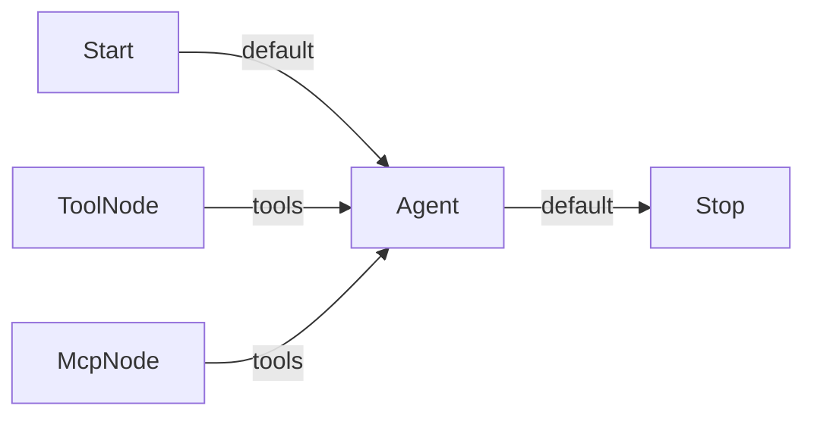
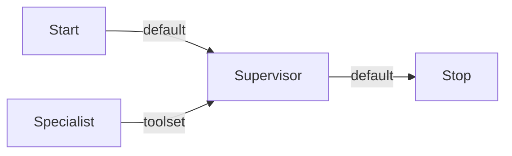
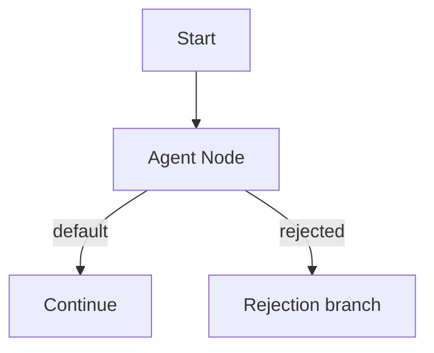
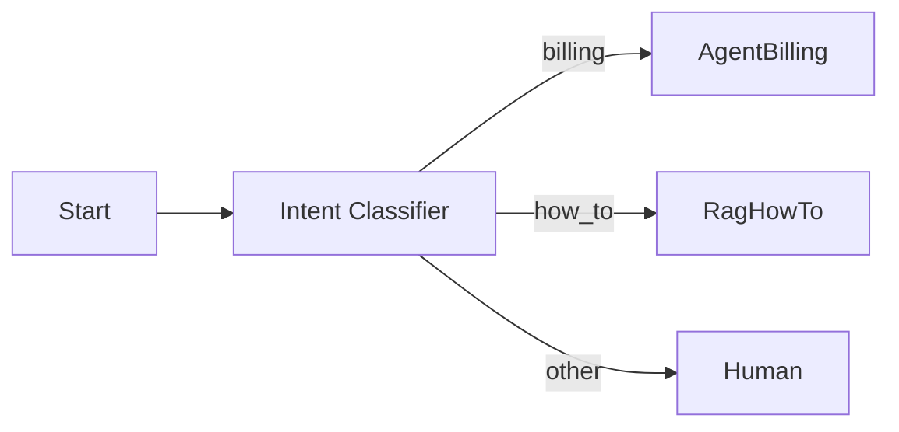
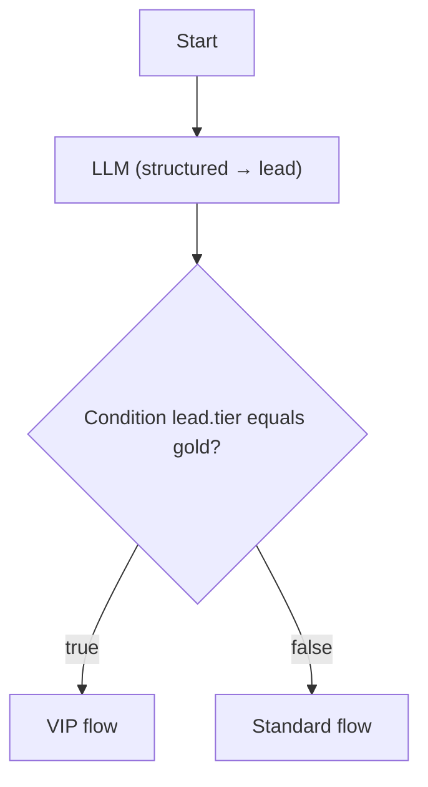
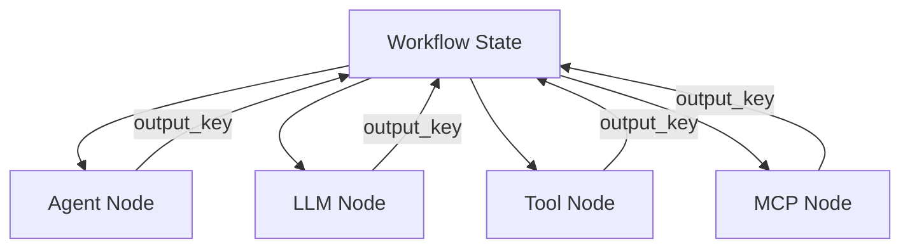

# AI Nodes

AI nodes invoke language models, agents, tools, and MCP connectors within a workflow graph.

## Agent

**Purpose:** Run an LLM agent step — either a saved studio agent or an inline agent configured on the canvas.

### Configuration modes

| Mode | `config_mode` | Behavior |
|------|---------------|----------|
| **Use existing** | `existing` | Load provider, model, instructions, and tools from `agent_id` (AgentDefinition) |
| **Configure on canvas** | `inline` | Configure `provider`, `model`, and `instructions` on the node; attach tools via canvas edges |

Legacy graphs without `config_mode` resolve to **existing** when `agent_id` is set, otherwise **inline**.

| Config | Description |
|--------|-------------|
| `config_mode` | `existing` or `inline` |
| `agent_id` | Database ID of the agent (required in existing mode) |
| `provider` | LLM provider key (required in inline mode) |
| `model` | Model ID (required in inline mode) |
| `instructions` | System prompt (inline mode) |
| `message` | User prompt / input template with `{{state_key}}` placeholders |
| `output_key` | State key for the response (default: `agent_response`) |
| `structured` | When `true`, validate and store typed output instead of plain text |
| `output_class` | FQCN or short name of a PHP output class (required when `structured` is on) |
| `require_tool_approval` | Optional per-node override. Pause for human approval before the agent runs any tool (see [Tool approval](#tool-approval)) |
| `stream` | When `true`, stream the response token-by-token via SSE during the step (see [Streaming](#streaming)) |
| `context_window` | Optional per-node memory override (tokens). Empty inherits the agent's `memory_config` |
| `driver` | Optional `eloquent` / `in_memory` override for this visit |
| `summarization_enabled` | Optional compaction override for this visit |
| `budget_rag` | Optional token cap for `rag_context` interpolation on this visit |
| `budget_tool_results` | Optional token cap for Neuron tool-loop results on this visit |
| `budget_state` | Optional per-field token cap for other interpolated state keys |

### Handles

| Handle | Side | Role |
|--------|------|------|
| `default` (target) | Left — Input | Control-flow input (Step Mode only) |
| `tools` (target) | Left — Tools | Binding pin: connect **Tool**, **MCP**, or Tool Mode agent **toolset** edges. Not a workflow step |
| `default` (source) | Right — Response | Control-flow output (Step Mode only) |
| `toolset` (source) | Right — Toolset | Tool Mode only: expose this agent as a tool for a supervisor |


```mermaid
flowchart LR
  Start -->|default| Agent
  ToolNode -->|tools| Agent
  McpNode -->|tools| Agent
  Agent -->|default| Stop
```

The cyan **tools** handle is visible in both **inline** and **existing** modes. Existing supervisors merge AgentDefinition tools with canvas bindings at runtime. Inline supervisors use canvas bindings only.

Binding edges (`targetHandle: tools` / `sourceHandle: toolset`) are excluded from cycle detection and next-step routing.

### Tool Mode (agent-as-tool)

Nodes with meta `toolable: true` (built-in **Agent** in v1) can flip between:

| Mode | UI | Graph role |
|------|-----|------------|
| **Step** (`tool_mode: false`) | Input + Response | Control-flow step |
| **Tool** (`tool_mode: true`) | Actions + Toolset | Binding-only specialist |

When Tool Mode is on:

1. Message **Input** is hidden; control-flow edges to/from the node are invalid.
2. **Actions** configures `tool_exposure` (slug, description, caller-controlled `input` param).
3. Connect the amber **toolset** handle → supervisor **tools** handle.


```mermaid
flowchart LR
  Start -->|default| Supervisor
  Specialist -->|toolset| Supervisor
  Supervisor -->|default| Stop
```

Runtime resolves each toolset edge as a `node:{id}` binding → Studio `NodeAsTool` (Neuron `Tool` wrapper that runs the specialist via `AgentRunner`). Native export **snapshots** the specialist config into generated PHP and omits the specialist as a linear workflow Node.

Empty slug defaults to meta `tool_exposure.slug_prefix` (e.g. `call_agent`). Slugs must be unique per supervisor and valid function names.

Example message (Step Mode):

```
Customer inquiry: {{input}}
Previous context: {{rag_context}}
```
### Prompt assembly budgets

When `budget_*` values are set on the agent or node, Studio truncates oversized prompt inputs before the model call:

- **RAG** (`budget_rag`): applies to `rag_context` / `rag_context.context`; keeps whole `\n\n---\n\n` chunks first, then truncates the last chunk (sentence boundary when possible). Takes precedence over `budget_state` for RAG fields.
- **Tool results** (`budget_tool_results`): caps each tool result before it is stored in chat history (persisted form matches what the model saw).
- **State fields** (`budget_state`): caps each interpolated field independently (arrays/objects use their JSON form).

Truncated text ends with an explicit `\n\n[truncated]` marker. Empty budgets leave content unchanged.

### Tool approval

Agent nodes can require a human to approve tool calls before they execute. Approval is enabled either on the [agent definition](../../agents/creating-agents.md#tool-approval) (**Require tool approval**) or per node via the `require_tool_approval` override in the node data.

When enabled and the model requests a tool:

1. The runtime applies the NeuronAI `ToolApproval` middleware to the agent.
2. Execution pauses **before** the tool runs; the trace status becomes `awaiting_tool_approval`.
3. The test harness renders an inline **Approve / Reject** card with the pending tool name and arguments.
4. Approving runs the tool and continues; rejecting skips it and (optionally) routes to a `rejected` handle.

Wire an optional `rejected` handle from the Agent node to branch execution when a tool is rejected:


```mermaid
flowchart TD
    Start[Start] --> Agent[Agent Node]
    Agent -->|default| Next[Continue]
    Agent -->|rejected| Halt[Rejection branch]
```

The node override precedes the agent definition flag: when `require_tool_approval` is present in the node data it wins; otherwise the agent's own setting applies. See [Human-in-the-Loop → Tool approval](../human-in-the-loop.md#tool-approval) and [Runtime & Traces](../runtime-and-traces.md#tool-approval-pause-awaiting_tool_approval).

<!-- SCREENSHOT: workflows-inspector-agent -->
> **Screenshot pending:** Agent node inspector fields.
>
> Asset path: `docs/assets/screenshots/workflows-inspector-agent.png`
> Capture: Workflow editor with Agent node selected in inspector — dark theme, 1440×900


### Attachments and thread memory in workflows

When an Agent node runs inside a workflow (especially within a **Loop**), the runtime:

1. Reads `state.attachments` uploaded in the test harness composer
2. Builds a multimodal `UserMessage` via `MessageFactory`
3. Reuses `__studio_thread_id` so agent memory persists across loop iterations

Example message template combining user input and prior structured output:

```
Customer inquiry: {{input}}
Extracted profile: {{lead_profile}}
```

Attach a PDF or image in the harness before sending — the same attachment array survives between loop iterations until the run completes. Tool calls during agent steps emit `tool_call` / `tool_result` SSE events. See [Autonomous agents in workflows](../overview.md#autonomous-agents-in-workflows) and [Attachments](../../agents/attachments.md#workflow-test-harness).

## LLM

**Purpose:** Direct LLM call without a full agent definition.

| Config | Description |
|--------|-------------|
| `provider` | LLM provider key |
| `model` | Model ID |
| `prompt` | Prompt template with `{{state_key}}` placeholders |
| `output_key` | State key for the response |
| `structured` | When `true`, validate and store typed output instead of plain text |
| `output_class` | FQCN or short name of a PHP output class (required when `structured` is on) |
| `stream` | When `true`, stream the response token-by-token via SSE during the step (see [Streaming](#streaming)) |
| `vision` | When `true` (default), include `state.attachments` in the model message. Set `false` to ignore attachments for this step |

Use when you need a one-off LLM step without tool bindings.

## Intent Classifier

**Purpose:** Classify a user message into one of several **intents** and route the workflow exclusively along that branch — a simplified alternative to LLM + Condition cascades. (Dify calls this a Question Classifier / “Class”; Studio uses **Intent** to match NLU practice and avoid colliding with PHP `output_class`.)

| Config | Description |
|--------|-------------|
| `provider` / `model` | LLM used for classification |
| `message` | Input template (default `{{input}}`) |
| `intents` | List of `{ id, name, description }`. Each `id` becomes a source handle |
| `instructions` | Optional extra guidance for the classifier |
| `output_key` | State key for the chosen intent id (default `intent`); also writes `{output_key}_name` |
| `vision` | When `true`, include run attachments (default `false`) |
| `memory` | When `true`, load conversation history from the workflow thread (default `false` uses in-memory history only) |
| `memory_config.context_window` | Optional token budget override when memory is on |

Classification uses Neuron structured output (`IntentClassificationResult`). Unknown ids fall back to `other` / `unknown` when present. Nested classifier runs always reuse `__studio_thread_id` for metering; **Memory** only toggles whether prior turns are sent to the model.

### Handles

| Handle | Side | Role |
|--------|------|------|
| `default` (target) | Left | Control-flow input |
| each `intents[].id` (source) | Right | Exclusive branch for that intent |


```mermaid
flowchart LR
  Start --> IC[Intent Classifier]
  IC -->|billing| AgentBilling
  IC -->|how_to| RagHowTo
  IC -->|other| Human
```

Prefer this node for graph routing. To expose classification as a tool to a supervisor, use an **Agent** in Tool Mode with the `intent-classifier` agent template instead.

## Streaming

Agent and LLM nodes can stream their text output token-by-token instead of blocking until the full response is ready. Set `stream: true` on the node to emit incremental `token` SSE events during the step; the chat surface renders the text as it arrives while the final content is still written to `output_key`.

Streaming applies only to plain-text responses on an interactive SSE run. It is automatically skipped (falling back to the blocking path) for **structured output** nodes and for Agent nodes with **tool approval** enabled. See [Runtime & Traces → Token streaming](../runtime-and-traces.md#token-streaming) for the event sequence.

## Structured output

Agent and LLM nodes support a **structured output** mode. Instead of storing the model response as a string, the runtime validates the response against a PHP output class and writes a typed array to `output_key`.

Enable structured mode in the node inspector:

1. Turn on **Structured output**
2. Select an **Output class** from the dropdown (scanned from `structured_output_scan_paths`)
3. Set **Output Key** — this becomes the state key for the validated object (e.g. `lead`)

When `structured` is off (default), behavior is unchanged: the node stores plain text at `output_key`.

### Output classes

Output classes are plain PHP classes with public properties annotated with NeuronAI `SchemaProperty`. The studio scans configured paths via `OutputClassRegistry` and exposes them in the inspector picker.

Example class at `app/Neuron/Output/LeadProfile.php`:

```php
use NeuronAI\StructuredOutput\SchemaProperty;

class LeadProfile
{
    #[SchemaProperty(description: 'Lead email address', required: true)]
    public string $email;

    #[SchemaProperty(description: 'Lead tier', required: false)]
    public ?string $tier = null;
}
```

The inspector shows a schema preview (property names, types, required flags) when a class is selected.

### Validation and traces

Structured responses pass through the NeuronAI validator. On success, state receives an associative array:

```json
{ "email": "alice@example.com", "tier": "gold" }
```

On validation failure, the workflow trace marks the step as **failed** and SSE `step_completed` events include `validation_errors` with field-level details. Downstream nodes do not run.

### Routing with Condition nodes

Store structured output under a dedicated key, then branch on nested fields using dot notation in the Condition node's **State Key** (e.g. `lead.tier`). See [State & Conditions](../state-and-conditions.md#conditions-on-structured-objects).


```mermaid
flowchart TD
    Start[Start] --> LLM["LLM (structured → lead)"]
    LLM --> Cond{"Condition lead.tier equals gold?"}
    Cond -->|true| VIP[VIP flow]
    Cond -->|false| Std[Standard flow]
```

Structured mode is compatible with agent tool bindings — the agent still runs with its configured tools, but the final response is validated against the output class.

## Tool

**Purpose:** Invoke a studio or registry tool directly.

| Config | Description |
|--------|-------------|
| `tool_ref` | Tool reference (e.g. `db:1`, `toolkit:calculator`) |
| `input` | Input template or JSON with `{{state_key}}` placeholders |
| `output_key` | State key for the result (default: `tool_result`) |

## MCP

**Purpose:** Call a tool exposed by an MCP server.

| Config | Description |
|--------|-------------|
| `server_id` | MCP server database ID |
| `tool_name` | Tool name from MCP discovery |
| `input` | Arguments template |
| `output_key` | State key for the result (default: `mcp_result`) |

## RAG

**Purpose:** Retrieve relevant chunks from a studio **Knowledge Base** and write structured context to workflow state for downstream Agent or LLM nodes.

| Config | Description |
|--------|-------------|
| `knowledge_base_id` | Database ID of the knowledge base (required) |
| `query` | Search query template with `{{state_key}}` or dot notation (e.g. `{{ rag_context.query }}`). Falls back to `input` when empty |
| `top_k` | Max chunks to retrieve (overrides KB defaults) |
| `threshold` | Minimum similarity score (overrides KB defaults) |
| `output_key` | State key for retrieval payload (default: `rag_context`) |

### Output shape

The node writes an associative array to `output_key`:

```json
{
  "query": "refund policy",
  "results": [{ "content": "...", "score": 0.82, "metadata": {} }],
  "context": "Chunk 1 text...\n\nChunk 2 text...",
  "knowledge_base_id": 1,
  "chunk_count": 2,
  "top_score": 0.82
}
```

Downstream nodes consume retrieved text via dot notation in templates:

```
Use this documentation to answer the customer:
{{ rag_context.context }}
```

The canvas inspector binds a knowledge base, query, retrieval limits, and includes a **debug search** preview against live indexed documents.

### Knowledge bases

Create and ingest documents under **Knowledge Bases** in the studio (`/neuronai-studio/knowledge-bases`). Upload PDFs or paste text; ingestion chunks, embeds, and indexes content into the configured vector store driver.

See [Knowledge Bases](../../knowledge-bases/overview.md), [Retrieval](../../knowledge-bases/retrieval.md), and [Configuration](../../../reference/configuration.md#rag).

## AI node comparison

| Node | Tools | Agent config | Best for |
|------|-------|--------------|----------|
| Agent | Via agent bindings | Required | Multi-turn agent with tools |
| LLM | No | No | Simple text generation |
| Tool | Single tool | No | Deterministic tool call |
| MCP | Single MCP tool | No | External MCP capability |
| RAG | No | No | Knowledge-base retrieval upstream of agents |


```mermaid
flowchart TD
    State[Workflow State] --> Agent[Agent Node]
    State --> LLM[LLM Node]
    State --> Tool[Tool Node]
    State --> MCP[MCP Node]
    Agent -->|output_key| State
    LLM -->|output_key| State
    Tool -->|output_key| State
    MCP -->|output_key| State
```

## Related code

- `AgentNodeExecutor`, `LlmNodeExecutor`, `ToolNodeExecutor`, `McpNodeExecutor`, `RagNodeExecutor`
- `StructuredOutputResolver`, `OutputClassRegistry`, `AgentRunner::structuredInline`
- `ToolApprovalRequiredException`, `AgentRunner` (`ToolApproval` middleware, `resumeInlineApproval`)

## See also

- [Creating Agents](../../agents/creating-agents.md)
- [State & Conditions](../state-and-conditions.md)
