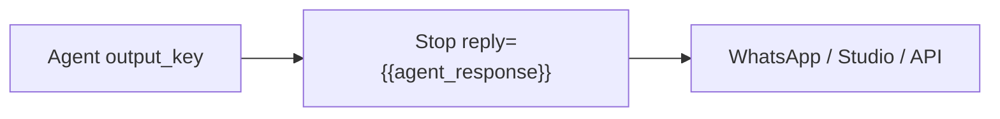
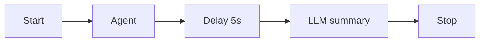

# Flow Nodes

Flow nodes control workflow execution structure — entry points, termination, pauses, and timing.

## Start

**Purpose:** Entry point for every workflow. Exactly one Start node is required.

| Config | Description |
|--------|-------------|
| (none) | Passes through to the next connected node |

All runs begin at the Start node. Initial state is merged from the test harness message and optional "Initial state JSON".

## Stop

**Purpose:** Terminates the workflow run successfully and (optionally) declares the **user-facing reply**.

| Config | Description |
|--------|-------------|
| `reply` | Template for the channel message (e.g. `{{agent_response}}`). Interpolated into `state.reply` when the Stop runs. |

At least one Stop node is required. A workflow may have multiple Stop nodes for different exit paths — give each branch its own Stop with the correct `reply`.

Channels (Studio Pretty, Vercel/AG-UI, WhatsApp integrate, MCP, nested `run_workflow`) read `state.reply` via `WorkflowReplyResolver`. Without `reply`, they fall back to a legacy last-string heuristic (fragile on large graphs).

Prefer **one Stop per exit path** rather than converging every branch into a single Stop that cannot know which key holds the answer.

## Delay

**Purpose:** Pause execution for a specified duration.

| Config | Description |
|--------|-------------|
| `seconds` | Delay duration (integer) |

Useful for rate limiting, waiting on external systems, or demo pacing.

## Human

**Purpose:** Pause execution and wait for user input (Human-in-the-Loop).

| Config | Description |
|--------|-------------|
| `prompt` | Message shown to the user (also published as the channel reply while paused) |
| `output_key` | State key for the reply (default: `human_response`) |

When the Human node executes, the workflow pauses and saves a checkpoint. Integrate clients receive the interpolated `prompt` as assistant text plus an `awaiting_input` signal. The user replies via the test harness or resume API, and execution continues from the checkpoint.

Always connect an outgoing edge from Human (typically back into a loop or toward Stop). A Human with no successor ends the run after resume with no explicit reply.

See [Human-in-the-Loop](../human-in-the-loop.md) for the full resume flow.

## Flow node summary

| Node | Category | Handles |
|------|----------|---------|
| Start | flow | 1 output |
| Stop | flow | 1 input |
| Delay | flow | 1 input, 1 output |
| Human | flow | 1 input, 1 output |

## Related code

- `StartNodeExecutor`, `StopNodeExecutor`, `DelayNodeExecutor`, `HumanNodeExecutor`

## See also

- [AI Nodes](ai-nodes.md)
- [Logic Nodes](logic-nodes.md)
