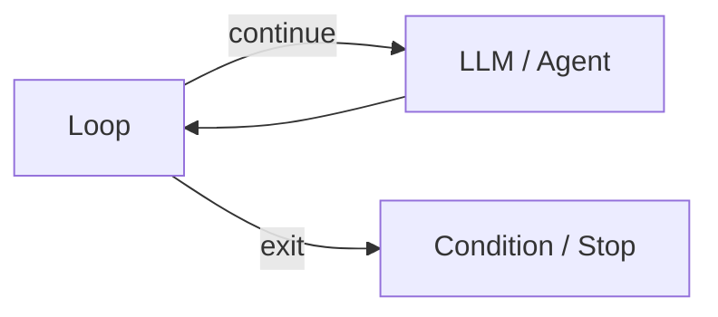
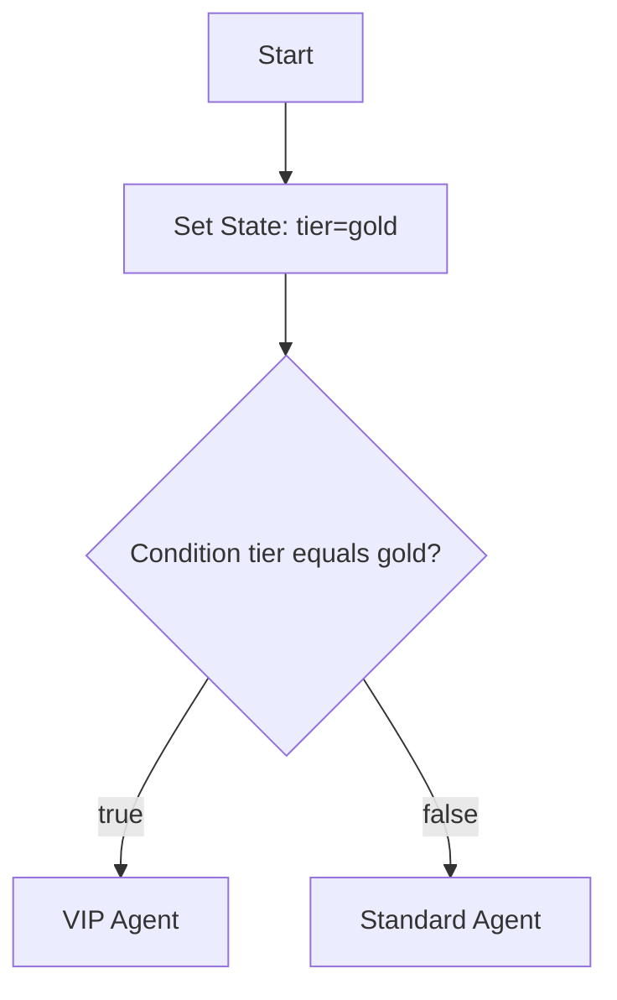

# Logic Nodes

Logic nodes control workflow branching and state manipulation.

## Loop

**Purpose:** Repeat a subgraph until an exit condition is met or `max_steps` is reached.

| Config | Description |
|--------|-------------|
| `max_steps` | Maximum iterations before `MaxLoopIterationsException` (default from config) |
| `state_key` | Key to read for exit condition (default: `input`) |
| `operator` | Same operators as Condition (`not_empty`, `empty`, `equals`, `not_equals`, `contains`) |
| `value` | Comparison value for `equals` / `contains` operators |

The node has two output handles:

| Handle | When |
|--------|------|
| `continue` | Exit condition is **not** met — follow the loop body |
| `exit` | Exit condition **is** met — leave the loop |

Back-edges into the loop body require a Loop node with `max_steps` > 0. `GraphValidator` rejects unauthorized cycles.

## Condition

**Purpose:** Branch execution based on a workflow state value.

| Config | Description |
|--------|-------------|
| `state_key` | Key to read from state (default: `input`) |
| `operator` | Comparison operator |
| `value` | Comparison value (for equals/contains operators) |

| Operator | Behavior |
|----------|----------|
| `not_empty` | Value is non-empty → true branch |
| `empty` | Value is empty → true branch |
| `equals` | Loose equality (`==`) against value |
| `not_equals` | Not equal to value |
| `contains` | String contains value |

The node has two output handles: `true` and `false`. Connect each to different downstream nodes.

See [State & Conditions](../state-and-conditions.md) for detailed examples.

## Set State

**Purpose:** Write or copy values into workflow state.

| Config | Description |
|--------|-------------|
| `key` | Target state key |
| `value` | Static value to write |
| `from_key` | Copy value from another state key (alternative to `value`) |

Use Set State to:

- Initialize default values mid-flow
- Rename or duplicate state keys
- Set flags for downstream Condition nodes

## Logic node summary

| Node | Inputs | Outputs |
|------|--------|---------|
| Loop | 1 | 2 (continue, exit) |
| Condition | 1 | 2 (true, false) |
| Set State | 1 | 1 |

## Related code

- `LoopNodeExecutor`, `ConditionNodeExecutor`, `SetStateNodeExecutor`
- `StateTemplateInterpolator` — for `{{key}}` in other nodes, not Condition evaluation

## See also

- [State & Conditions](../state-and-conditions.md)
- [Flow Nodes](flow-nodes.md)
