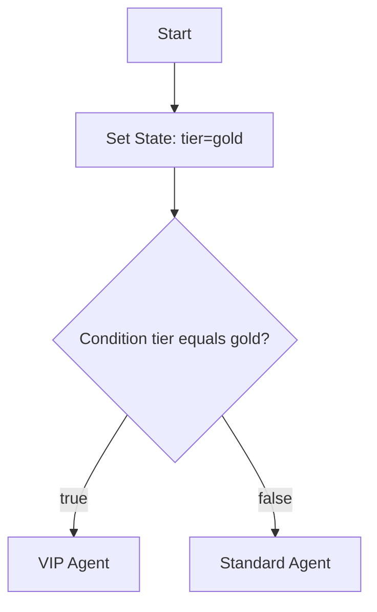

# Logic Nodes

Logic nodes control workflow branching and state manipulation.

## Condition

**Purpose:** Branch execution based on a workflow state value.

| Config | Description |
|--------|-------------|
| `state_key` | Key to read from state (default: `input`) |
| `operator` | Comparison operator |
| `value` | Comparison value (for equals/contains operators) |

| Operator | Behavior |
|----------|----------|
| `not_empty` | Value is non-empty → true branch |
| `empty` | Value is empty → true branch |
| `equals` | Loose equality (`==`) against value |
| `not_equals` | Not equal to value |
| `contains` | String contains value |

The node has two output handles: `true` and `false`. Connect each to different downstream nodes.

See [State & Conditions](../state-and-conditions.md) for detailed examples.

## Set State

**Purpose:** Write or copy values into workflow state.

| Config | Description |
|--------|-------------|
| `key` | Target state key |
| `value` | Static value to write |
| `from_key` | Copy value from another state key (alternative to `value`) |

Use Set State to:

- Initialize default values mid-flow
- Rename or duplicate state keys
- Set flags for downstream Condition nodes

## Logic node summary

| Node | Inputs | Outputs |
|------|--------|---------|
| Condition | 1 | 2 (true, false) |
| Set State | 1 | 1 |

## Related code

- `ConditionNodeExecutor`, `SetStateNodeExecutor`
- `StateTemplateInterpolator` — for `{{key}}` in other nodes, not Condition evaluation

## See also

- [State & Conditions](../state-and-conditions.md)
- [Flow Nodes](flow-nodes.md)
