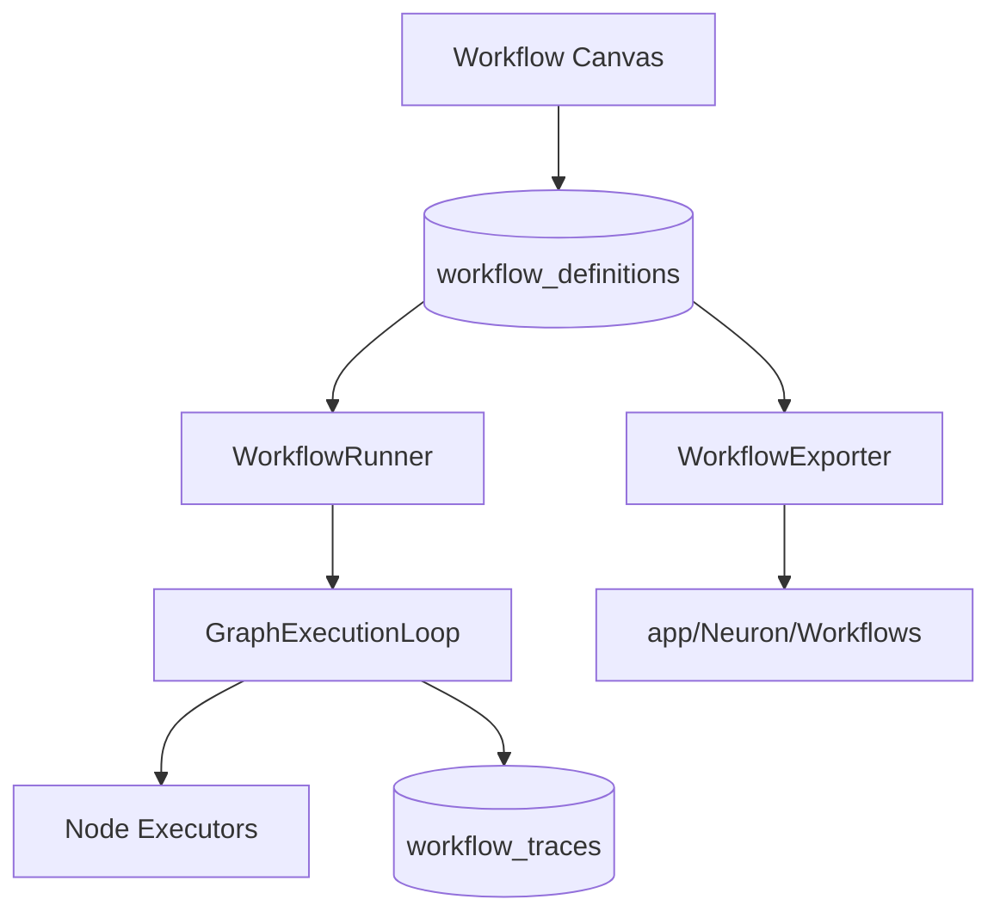
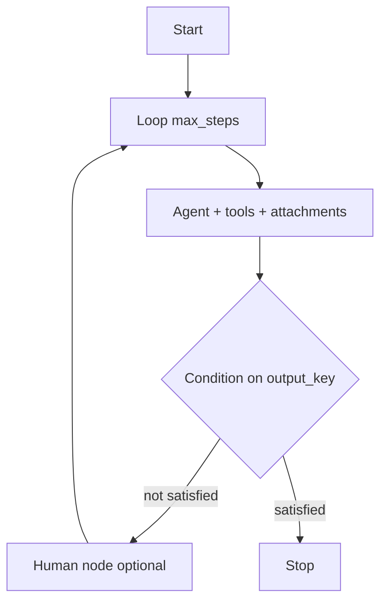
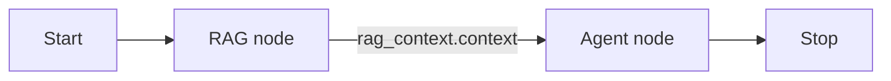

# Workflows Overview

Workflows are visual graphs that orchestrate multi-step AI processes. Compose nodes on a canvas, run them from a test harness, inspect traces, and export to production PHP classes.

## Core concepts

| Concept | Description |
|---------|-------------|
| **Graph** | Nodes and edges stored as JSON in `workflow_definitions` |
| **State** | Mutable key-value map shared across nodes during a run |
| **Trace** | Persisted execution record with per-step timeline |
| **Node** | A single step (agent call, condition, delay, etc.) |
| **Edge** | Connection between node handles |

## Node types (15)

| Category | Types |
|----------|-------|
| Flow | start, stop, delay, human |
| AI | agent, llm, tool, mcp, rag |
| Logic | condition, set_state, loop, fork, join |

See the [node type guides](node-types/flow-nodes.md) for configuration details.

## Studio routes

| Route | Purpose |
|-------|---------|
| `/neuronai-studio/workflows` | List workflows |
| `/neuronai-studio/workflows/create` | Create workflow |
| `/neuronai-studio/workflows/{id}/edit` | Visual editor |
| `/neuronai-studio/workflows/{id}/traces` | Execution history |

## Workflow sources

Workflows can originate from:

| Source | Description |
|--------|-------------|
| Studio UI | Created and edited on the canvas |
| Templates | Installed from JSON templates |
| PHP import | Scanned `StudioWorkflow` classes |
| JSON import | Files in `workflow_json_paths` |

## Typical workflow patterns

| Pattern | Nodes used |
|---------|------------|
| Simple chat | start → agent → stop |
| Branching logic | start → llm → condition → agents → stop |
| Human approval | start → agent → human → agent → stop |
| Tool pipeline | start → tool → llm → stop |
| Cyclic refinement | start → loop → agent/llm → loop → stop |
| Autonomous lead qualification | start → loop → agent (tools + attachments) → condition → stop |
| Parallel fan-out | start → fork → (branch a, branch b) → join → stop |

## Cyclic graphs

Workflows may contain cycles when a **Loop** node authorizes back-edges. Each loop enforces `max_steps` to prevent infinite execution. Use loops for iterative extraction, qualification, or refinement until a state condition is satisfied.

## Sequential vs parallel

By default nodes run **sequentially** — each node completes before the next begins, and every
node reads the state left by its predecessor. Reach for **parallel** execution (a
[Fork/Join](node-types/logic-nodes.md#fork) pair) when independent work can proceed
concurrently and only needs to be recombined at the end — for example extracting structured
data and generating an image description from the same input, or fanning out to several models
and merging their answers.

Prefer sequential when a later step depends on an earlier step's output; prefer parallel when
branches are independent and each writes to a distinct output key. Because branches execute in
isolated state, they cannot observe one another's partial writes — the Join node is the single
point where their results are merged.

## Autonomous agents in workflows

Combine loops with **Agent** nodes, multimodal attachments, and shared `__studio_thread_id` so the agent retains conversation memory across iterations. Tool calls during agent steps emit `tool_call` / `tool_result` SSE events in the test harness.

### End-to-end pattern

| Concern | Mechanism |
|---------|-----------|
| Multimodal input | `state.attachments` from harness composer → `MessageFactory` |
| Memory across iterations | Stable `__studio_thread_id` per trace/run |
| Exit criteria | Condition node on agent `output_key` (dot notation supported) |
| Safety | Loop `max_steps` guardrail |
| Observability | SSE `tool_call`, `tool_result`, `loop_iteration` events |

Try the bundled **Autonomous Lead Qualification** template — see [Templates](../templates.md#autonomous-lead-qualification).

For a hands-on walkthrough, see [Quickstart: First Workflow](../../getting-started/quickstart-first-workflow.md#optional-autonomous-loop-with-attachments).

## RAG → Agent pattern

Retrieve documentation or product context upstream, then pass it to an Agent node:

1. Create a [Knowledge Base](../agents/overview.md#knowledge-bases) and ingest documents
2. Add a **RAG** node with `output_key: rag_context`
3. Reference `{{ rag_context.context }}` in the Agent message template

The bundled `support-rag-hitl` template combines RAG retrieval with human approval — see [Templates](../templates.md).

## Next steps

- [Canvas Editor](canvas-editor.md)
- [State & Conditions](state-and-conditions.md)
- [Runtime & Traces](runtime-and-traces.md)
