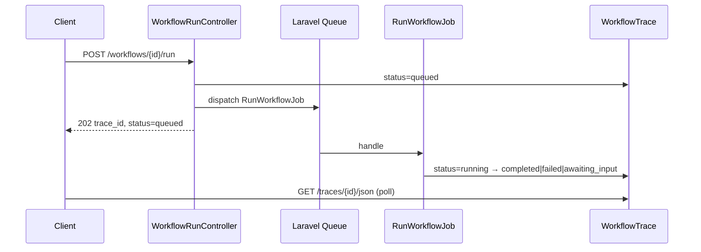

# Runtime & Traces

Execute workflows from the test harness with server-sent events (SSE), persisted trace records, and step-by-step inspection.

## Running a workflow

Open a workflow editor and use the **Test** panel (workflow chat harness). Each run:

1. Sets `input` in state from your message
2. Merges optional "Initial state JSON"
3. Executes nodes via `GraphExecutionLoop`
4. Streams events to the browser
5. Persists a trace record

<!-- SCREENSHOT: workflows-test-harness -->
> **Screenshot pending:** Test harness running a workflow.
>
> Asset path: `docs/assets/screenshots/workflows-test-harness.png`
> Capture: Workflow editor test panel with active run — dark theme, 1440×900


## Streaming architecture

```mermaid
sequenceDiagram
    participant UI as TestHarness
    participant API as WorkflowStreamController
    participant Runner as WorkflowRunner
    participant Loop as GraphExecutionLoop
    participant Trace as WorkflowTrace

    UI->>API: POST /workflows/{id}/run/stream
    API->>Runner: execute(workflow, state)
    Runner->>Loop: next node
    Loop-->>API: step/token events SSE
    API-->>UI: stream events
    Loop->>Trace: persist step
    Loop->>Loop: until stop or HITL
```

### SSE event types

| Event | Description |
|-------|-------------|
| `thread` | Workflow chat thread ID for the run |
| `step_started` | Node execution begins |
| `step_completed` | Node finished with handle and duration |
| `loop_iteration` | Loop node incremented (`iteration`, `max_steps`, `node_id`) |
| `tool_call` | Agent node invoked a tool |
| `tool_result` | Tool returned a result during agent step |
| `rag_query` | RAG node completed retrieval (`query`, `knowledge_base_id`, `chunk_count`, `top_score`) |
| `human_input_required` | Workflow paused at Human node |
| `trace_completed` | Run finished successfully |
| `trace_failed` | Execution failure |

## Trace records

Every run creates a `WorkflowTrace` with associated `WorkflowTraceStep` records.

<!-- SCREENSHOT: workflows-traces-list -->
> **Screenshot pending:** Trace list for a workflow.
>
> Asset path: `docs/assets/screenshots/workflows-traces-list.png`
> Capture: `/neuronai-studio/workflows/{id}/traces` — dark theme, 1440×900


### Trace list

```
/neuronai-studio/workflows/{id}/traces
```

Shows run status, duration, and timestamps.

### Trace detail

```
/neuronai-studio/traces/{id}
```

<!-- SCREENSHOT: workflows-trace-detail -->
> **Screenshot pending:** Step timeline with input/output expanded.
>
> Asset path: `docs/assets/screenshots/workflows-trace-detail.png`
> Capture: Trace detail page — dark theme, 1440×900


Each step shows:

- Node type and ID
- Input state snapshot
- Output / error
- Duration

Export trace JSON:

```
/neuronai-studio/traces/{id}/json
```

## Queue runner

When async runs are enabled, workflows can execute in a Laravel queue worker instead of blocking the HTTP request. The test harness still uses synchronous SSE by default; async mode is API-first for production integrations and long-running graphs.

### Flow

1. `POST /workflows/{id}/run` — creates a trace with `status: queued` and dispatches `RunWorkflowJob`
2. Poll `GET /workflows/traces/{id}/json` until the trace reaches a terminal state (`completed`, `failed`, or `awaiting_input`)
3. For human-in-the-loop, `POST /workflows/traces/{id}/resume` enqueues `ResumeWorkflowJob` and returns `status: queued`; poll again until terminal



### v1 behavior

- Jobs run with `emitter: null` — no SSE events during background execution
- Status polling via the existing trace JSON endpoint covers progress for v1
- Synchronous stream endpoints (`/run/stream`, `/resume/stream`) remain unchanged when `async_runs_enabled` is `false`

### Enable async runs

```env
NEURONAI_STUDIO_ASYNC_RUNS_ENABLED=true
NEURONAI_STUDIO_QUEUE=default
NEURONAI_STUDIO_QUEUE_CONNECTION=
NEURONAI_STUDIO_QUEUE_TRIES=1
NEURONAI_STUDIO_QUEUE_BACKOFF=30
```

Run a queue worker in production:

```bash
php artisan queue:work --queue=default
```

See [Configuration](../../reference/configuration.md) and [Installation](../../getting-started/installation.md).

## Initial state JSON

Pass structured context at run start:

```json
{
  "tier": "gold",
  "customer_id": "12345"
}
```

Reference keys in node templates with `{{tier}}`, `{{customer_id}}`, etc.

## Attachments and thread propagation

During autonomous workflow runs (loops with Agent nodes):

| State key | Set by | Purpose |
|-----------|--------|---------|
| `input` | Harness composer | Latest user message per send/resume |
| `attachments` | Harness upload API | Multimodal files (images, PDF, etc.) |
| `__studio_thread_id` | Workflow runner | Stable thread for agent memory across iterations |

Attachments persist in workflow state between loop iterations until the run completes. Agent nodes pass them to `MessageFactory` alongside the interpolated message template.

Trace steps for agent nodes may include thread references and attachment counts. RAG steps include retrieval metadata (`chunk_count`, `top_score`) in SSE `rag_query` events and trace payloads.

See [Attachments](../agents/attachments.md#workflow-test-harness) and [Playground & Threads](../agents/playground-and-threads.md#workflow-threads).

## Related code

- `WorkflowRunner`, `GraphExecutionLoop`, `GraphInterpreterWorkflow`
- `WorkflowTrace`, `WorkflowTraceStep` models
- `WorkflowStreamController`, `WorkflowTraceController`
- `WorkflowRunController`, `WorkflowTraceResumeJsonController`
- `RunWorkflowJob`, `ResumeWorkflowJob`

## See also

- [Human-in-the-Loop](human-in-the-loop.md)
- [State & Conditions](state-and-conditions.md)
