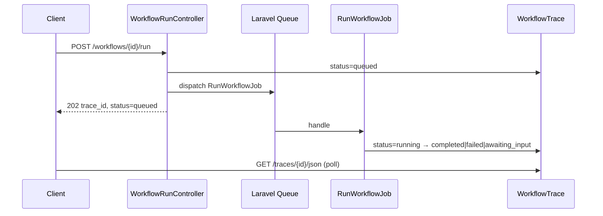

# Runtime & Traces

Execute workflows from the test harness with server-sent events (SSE), persisted trace records, and step-by-step inspection.

## External observability

Native Studio traces (this page) can run alongside env-first exporters:

- [Native tracing toggle](../observability/native-tracing.md)
- [Inspector APM](../observability/inspector.md)
- [Langfuse](../observability/langfuse.md)

## Running a workflow

Open a workflow editor and use the **Test** panel (workflow chat harness). Each run:

1. Sets `input` in state from your message
2. Merges optional "Initial state JSON"
3. Executes nodes via `GraphExecutionLoop`
4. Streams events to the browser
5. Persists a trace record

<!-- SCREENSHOT: workflows-test-harness -->
> **Screenshot pending:** Test harness running a workflow.
>
> Asset path: `docs/assets/screenshots/workflows-test-harness.png`
> Capture: Workflow editor test panel with active run — dark theme, 1440×900


## Streaming architecture

```mermaid
sequenceDiagram
    participant UI as TestHarness
    participant API as WorkflowStreamController
    participant Runner as WorkflowRunner
    participant Loop as GraphExecutionLoop
    participant Trace as WorkflowTrace

    UI->>API: POST /workflows/{id}/run/stream
    API->>Runner: execute(workflow, state)
    Runner->>Loop: next node
    Loop-->>API: step/token events SSE
    API-->>UI: stream events
    Loop->>Trace: persist step
    Loop->>Loop: until stop or HITL
```

### SSE event types

| Event | Description |
|-------|-------------|
| `thread` | Workflow chat thread ID for the run |
| `step_started` | Node execution begins |
| `token` | Incremental text delta from a streaming Agent/LLM node (`node_id`, `delta`) |
| `step_completed` | Node finished with handle, duration, and Agent/LLM usage when available |
| `loop_iteration` | Loop node incremented (`iteration`, `max_steps`, `node_id`) |
| `tool_call` | Agent node invoked a tool |
| `tool_result` | Tool returned a result during agent step |
| `rag_query` | RAG node completed retrieval (`query`, `knowledge_base_id`, `chunk_count`, `top_score`) |
| `human_input_required` | Workflow paused at Human node |
| `tool_approval_required` | Agent node paused before running a tool (`node_id`, `pending_tools`, `message`; includes `branch_id` when paused inside a fork) |
| `tool_approval_resolved` | Tool approval decision applied on resume (`approved`; includes `branch_id` for parallel pauses) |
| `branch_started` | A parallel branch began (`fork_id`, `branch_id`) |
| `branch_completed` | A parallel branch finished (`fork_id`, `branch_id`, `duration_ms`) |
| `parallel_interrupt` | A parallel branch paused for human input or tool approval (`fork_id`, `branch_id`, `node_id`, `reason`) |
| `trace_completed` | Run finished successfully with finalized token and estimated-cost totals |
| `trace_failed` | Execution failure |

## Token streaming

Agent and LLM nodes can stream their response token-by-token during a step instead of blocking until the full reply is ready — the same real-time experience as the agent playground.

Enable it per node with `data.stream: true`. When streaming is active, the runner emits a `token` event for each text delta between the node's `step_started` and `step_completed` boundaries:

```
event: step_started    (node_id: agent_1)
event: token           (node_id: agent_1, delta: "Hello")
event: token           (node_id: agent_1, delta: " world")
event: step_completed  (node_id: agent_1, handle: default)
```

The `StudioChat` chat surface aggregates consecutive `token` deltas into the assistant bubble, so text appears incrementally. On the streaming path, `tool_call` / `tool_result` events are emitted **live** as Neuron yields tool chunks (with post-history dedupe). Downstream nodes and trace records still receive the final content on `output_key`.

In the **Pretty** view, completed Agent and LLM rows show their step tokens and estimated cost beside duration. The Completed header shows finalized run-level usage.

Streaming falls back to the blocking path (no `token` events) when:

- the node uses **structured output** (`structured: true`) — validation requires the complete response, or
- the Agent node has **tool approval** enabled — the run pauses on the interrupt instead.

## Tool approval pause (`awaiting_tool_approval`)

When an Agent node has [tool approval](human-in-the-loop.md#tool-approval) enabled and the model requests a tool, the runner pauses **before** the tool executes and persists a distinct `awaiting_tool_approval` status (separate from the Human node's `awaiting_input`).

The checkpoint stores everything needed to resume from the same node without re-running earlier steps:

```php
[
    'status' => 'awaiting_tool_approval',
    'awaiting_node_id' => 'agent_1',
    'checkpoint' => [
        'state' => [/* state snapshot */],
        'node_id' => 'agent_1',
        'pending_tools' => [
            ['name' => 'delete_file', 'arguments' => ['path' => '/tmp/report.txt'], 'call_id' => 'call_1'],
        ],
        'interrupt' => '/* serialized NeuronAI WorkflowInterrupt */',
    ],
]
```

### Resume payload

Resume with an approval decision instead of a chat message:

```
POST /neuronai-studio/workflows/traces/{id}/resume/stream
```

```json
{
  "node_id": "agent_1",
  "approval": "approve",
  "message": "optional feedback (used on reject)"
}
```

- `approval: "approve"` — the tool runs and the node continues on `default`.
- `approval: "reject"` — the tool is skipped with the rejection feedback; if the Agent node has a `rejected` handle wired, execution routes there, otherwise it continues on `default`.
- `message` is optional; when rejecting it is forwarded to the model as the user's instruction.

Async resume (`POST /workflows/traces/{id}/resume`) accepts the same `approval` field and enqueues `ResumeWorkflowJob`.

## Parallel execution

[Fork and Join nodes](node-types/logic-nodes.md#fork) run several branch subgraphs and merge
their results. The interpreted runtime executes each branch in an **isolated copy of the
state** up to the paired Join node, then the Join node writes a `{ branchId: result }` map to
its `output_key`.

Each branch emits its own `step_started` / `step_completed` events (so branch nodes appear in
the trace timeline) wrapped by `branch_started` / `branch_completed`:

```
event: step_started    (node_id: fork_1, node_type: fork)
event: branch_started  (fork_id: fork_1, branch_id: branch_a)
event: step_started    (node_id: llm_a)
event: step_completed  (node_id: llm_a)
event: branch_completed(fork_id: fork_1, branch_id: branch_a, duration_ms: 812)
event: branch_started  (fork_id: fork_1, branch_id: branch_b)
...
event: step_completed  (node_id: fork_1)
event: step_started    (node_id: join_1, node_type: join)
```

If a branch pauses (a Human node or an approval-gated Agent inside the branch), the runner
persists a **parallel checkpoint** (`kind: parallel`) and emits `parallel_interrupt` followed
by `human_input_required` or `tool_approval_required` (including `branch_id`). Status is
`awaiting_input` or `awaiting_tool_approval` to match the interrupt reason. Resuming continues
only the interrupted branch and re-runs any branches that had not started yet, reusing the
results of branches that already completed. See
[Parallel branches](human-in-the-loop.md#parallel-branches).

## Node checkpoints

Expensive nodes (Agent, LLM, RAG, Tool) can opt into **checkpointing** so that a resumed run
does not re-execute a step whose result is already known. Set `data.checkpoint: true` on the
node. On the first execution the resulting state change is stored in the
`neuronai_studio_workflow_checkpoints` table keyed by
`sha256(trace_id | node_id | iteration | input_hash)`; on resume the stored change is merged
back and the underlying provider call is skipped.

The `input_hash` is derived from the node's input state (excluding volatile internal keys), so
changing the relevant upstream state **invalidates** the checkpoint and the node runs again.
Loop bodies are scoped by iteration, so each pass keeps its own checkpoint.

Checkpointing is controlled globally by `neuronai-studio.checkpoints.enabled` and expires via
`neuronai-studio.checkpoints.ttl`. See [Configuration](../../reference/configuration.md#checkpoints)
and [Database schema](../../reference/database-schema.md#workflow-checkpoints). Expired rows are
removed by `php artisan neuronai-studio:checkpoints:purge`.

## Trace records

Every run creates a `WorkflowTrace` with associated `WorkflowTraceStep` records.

<!-- SCREENSHOT: workflows-traces-list -->
> **Screenshot pending:** Trace list for a workflow.
>
> Asset path: `docs/assets/screenshots/workflows-traces-list.png`
> Capture: `/neuronai-studio/workflows/{id}/traces` — dark theme, 1440×900


### Trace list

```
/neuronai-studio/workflows/{id}/traces
```

Shows run status, duration, timestamps, and total tokens.

### Trace detail

```
/neuronai-studio/traces/{id}
```

<!-- SCREENSHOT: workflows-trace-detail -->
> **Screenshot pending:** Step timeline with input/output expanded.
>
> Asset path: `docs/assets/screenshots/workflows-trace-detail.png`
> Capture: Trace detail page — dark theme, 1440×900


Each step shows:

- Node type and ID
- Input state snapshot
- Output / error
- Duration
- LLM prompt/completion/total tokens, provider/model, and estimated cost

Export trace JSON:

```
/neuronai-studio/traces/{id}/json
```

### Context truncation spans

When prompt-assembly budgets truncate RAG, tool results, or state fields, Studio writes a span with:

| Field | Value |
|-------|--------|
| `type` | `context` |
| `name` | `context_truncation` |
| `output.kind` | `rag_context` / `tool_result` / `state_field` |
| `output.field` or `output.tool` | Source name |
| `output.tokens_before` / `tokens_after` | Estimate (~4 chars/token) |
| `output.strategy` | `sentence` / `hard` |

Spans are skipped when `NEURONAI_STUDIO_NATIVE_TRACING=false`, but truncation still applies. History compaction uses a separate `memory` / `history_compaction` span.

## Queue runner

When async runs are enabled, workflows can execute in a Laravel queue worker instead of blocking the HTTP request. The test harness still uses synchronous SSE by default; async mode is API-first for production integrations and long-running graphs.

### Flow

1. `POST /workflows/{id}/run` — creates a trace with `status: queued` and dispatches `RunWorkflowJob`
2. Poll `GET /workflows/traces/{id}/json` until the trace reaches a terminal state (`completed`, `failed`, or `awaiting_input`)
3. For human-in-the-loop, `POST /workflows/traces/{id}/resume` enqueues `ResumeWorkflowJob` and returns `status: queued`; poll again until terminal



### v1 behavior

- When `async_progress.enabled` is true (default), jobs use a `ProgressEmitter` that appends step events to a cache buffer and flushes incremental `async_progress_steps` on the run checkpoint
- Live progress: `GET /workflows/runs/{run}/events/stream` (SSE tail of the buffer until `run_terminal`)
- Status polling via the existing trace JSON endpoint remains a fallback
- Synchronous stream endpoints (`/run/stream`, `/resume/stream`) remain unchanged when `async_runs_enabled` is `false`
- Laravel Echo / `ShouldBroadcast` is **not** required for Studio progress

### Enable async runs

```env
NEURONAI_STUDIO_ASYNC_RUNS_ENABLED=true
NEURONAI_STUDIO_QUEUE=default
NEURONAI_STUDIO_QUEUE_CONNECTION=
NEURONAI_STUDIO_QUEUE_TRIES=1
NEURONAI_STUDIO_QUEUE_BACKOFF=30
NEURONAI_STUDIO_ASYNC_PROGRESS_ENABLED=true
```

Run a queue worker in production:

```bash
php artisan queue:work --queue=default
```

See [Configuration](../../reference/configuration.md) and [Installation](../../getting-started/installation.md).

## Initial state JSON

Pass structured context at run start:

```json
{
  "tier": "gold",
  "customer_id": "12345"
}
```

Reference keys in node templates with `{{tier}}`, `{{customer_id}}`, etc.

## Attachments and thread propagation

During autonomous workflow runs (loops with Agent nodes):

| State key | Set by | Purpose |
|-----------|--------|---------|
| `input` | Harness composer | Latest user message per send/resume |
| `attachments` | Harness upload API | Multimodal files (images, PDF, etc.) |
| `__studio_thread_id` | Workflow runner | Stable thread for agent memory across iterations |

Attachments persist in workflow state between loop iterations until the run completes. Agent nodes pass them to `MessageFactory` alongside the interpolated message template.

Trace steps for agent nodes may include thread references and attachment counts. RAG steps include retrieval metadata (`chunk_count`, `top_score`) in SSE `rag_query` events and trace payloads.

See [Attachments](../agents/attachments.md#workflow-test-harness) and [Playground & Threads](../agents/playground-and-threads.md#workflow-threads).

## Related code

- `WorkflowRunner`, `GraphExecutionLoop`, `GraphInterpreterWorkflow`
- `ForkNodeExecutor`, `JoinNodeExecutor`, `ParallelBranchRunner`
- `CheckpointService`, `CheckpointingExecutor`, `WorkflowCheckpoint` model
- `WorkflowTrace`, `WorkflowTraceStep` models
- `WorkflowStreamController`, `WorkflowTraceController`
- `WorkflowRunController`, `WorkflowTraceResumeJsonController`
- `RunWorkflowJob`, `ResumeWorkflowJob`

## See also

- [Human-in-the-Loop](human-in-the-loop.md)
- [State & Conditions](state-and-conditions.md)
