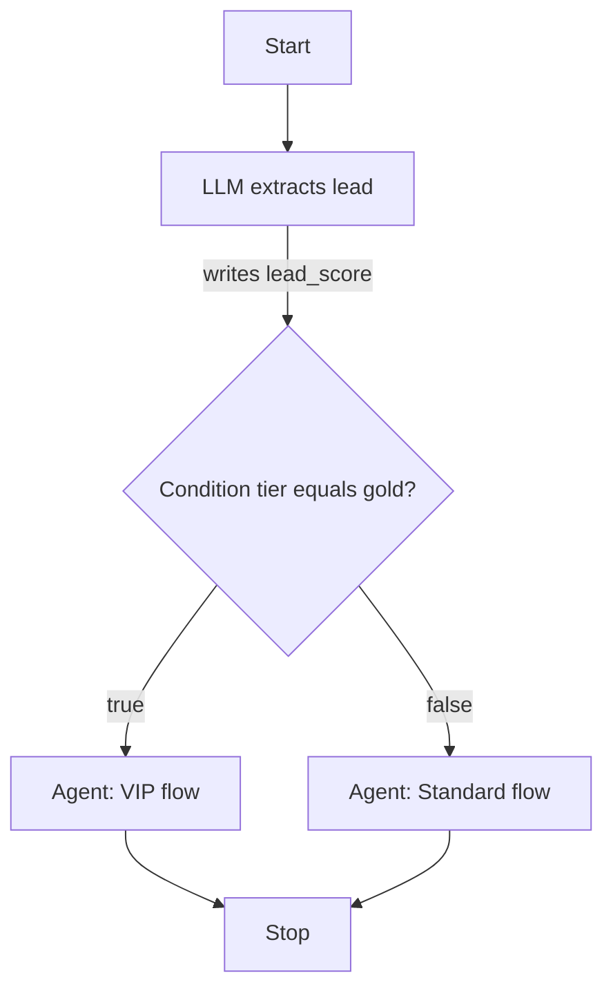

# Workflow State & Conditions

Workflows share a mutable key-value **state** (`WorkflowState`) for the duration of a run. Every node can read from and write to this map. The **Condition** node evaluates a value from state and routes to the `true` or `false` branch.

## Where state keys come from

| Source | Key(s) | How it enters state |
|--------|--------|---------------------|
| Chat message (test harness) | `input` | Always set from the composer message on each run |
| Playground "Initial state JSON" | Any top-level keys | Sent as `state` in the run request and merged at start |
| **Agent** node | `output_key` (default: `agent_response`) | Agent response text |
| **LLM** / **RAG** nodes | `output_key` | Node output |
| **Tool** / **MCP** nodes | `output_key` (default: `tool_result` / `mcp_result`) | Tool result payload |
| **Human** node | `output_key` (default: `human_response`) | User reply when the run resumes |
| **Set State** node | `key` from node config | Static `value` or copy from `from_key` |

Internal keys such as `__workflow_run_id`, `__current_node_id`, and `__steps` are reserved for runtime bookkeeping.

## State template interpolation

Prompt and message fields support `{{state_key}}` placeholders. At runtime, `StateTemplateInterpolator` replaces them with values from workflow state.

Example agent node message:

```
User message: {{input}}
Customer tier: {{tier}}
```

If state contains `{ "input": "Hello", "tier": "gold" }`, the agent receives:

```
User message: Hello
Customer tier: gold
```

This works in agent messages, LLM prompts, tool inputs, and template JSON files.

## Condition node

The Condition node reads `state_key` from workflow state (default: `input`), applies an **operator**, and returns handle `true` or `false`.

| Operator | Behavior |
|----------|----------|
| `not_empty` | Value is non-empty → `true` (default) |
| `empty` | Value is empty → `true` |
| `equals` | Loose equality (`==`) against **Value** |
| `not_equals` | Not equal to **Value** |
| `contains` | String contains **Value** |

Connect the `true` and `false` handles on the canvas to different downstream nodes.

<!-- SCREENSHOT: workflows-inspector-condition -->
> **Screenshot pending:** Condition node inspector with true/false handles visible on canvas.
>
> Asset path: `docs/assets/screenshots/workflows-inspector-condition.png`
> Capture: Workflow editor with a Condition node selected — dark theme, 1440×900


### Example: branch on Playground context

Playground initial state JSON:

```json
{
  "tier": "gold"
}
```

Condition config:

- **State Key:** `tier`
- **Operator:** `equals`
- **Value:** `gold`

The chat message still populates `input` separately; use **State Key** to reference any top-level key from the initial JSON or from upstream nodes.



### Limitations

- Keys are **flat**. Use `tier`, not `user.tier`. Nested objects are stored as whole values.
- The Condition node reads `WorkflowState` only; it does not read graph metadata or a separate "context" object.

## Related code

- Initial state: `WorkflowRunner::buildInitialState()`
- Interpolation: `StateTemplateInterpolator`
- Condition evaluation: `ConditionNodeExecutor`
- Test harness: Playground "Initial state JSON" → `WorkflowSessionAdapter` → `state` request field

## See also

- [Logic Nodes](node-types/logic-nodes.md) — Set State node details
- [Runtime & Traces](runtime-and-traces.md) — how state flows through execution
