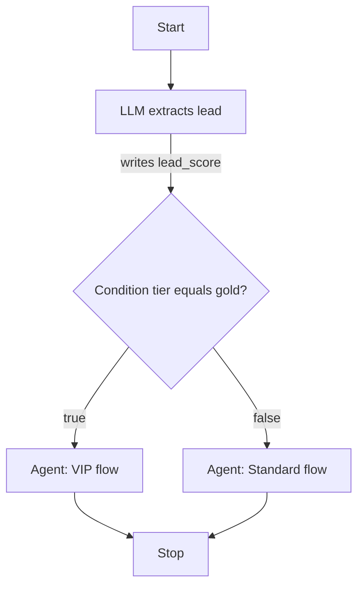
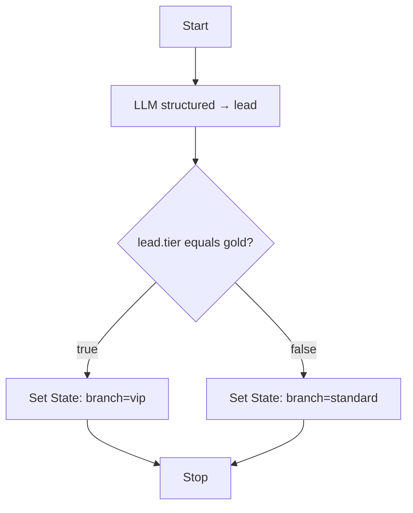

# Workflow State & Conditions

Workflows share a mutable key-value **state** (`WorkflowState`) for the duration of a run. Every node can read from and write to this map. The **Condition** node evaluates a value from state and routes to the `true` or `false` branch.

## Where state keys come from

| Source | Key(s) | How it enters state |
|--------|--------|---------------------|
| Chat message (test harness) | `input` | Always set from the composer message on each run |
| Playground "Initial state JSON" | Any top-level keys | Sent as `state` in the run request and merged at start |
| **Agent** node | `output_key` (default: `agent_response`) | Agent response text, or validated array when `structured` is on |
| **LLM** / **RAG** nodes | `output_key` | Node output (string, or validated array when `structured` is on) |
| **Tool** / **MCP** nodes | `output_key` (default: `tool_result` / `mcp_result`) | Tool result payload |
| **Human** node | `output_key` (default: `human_response`) | User reply when the run resumes |
| **Set State** node | `key` from node config | Static `value` or copy from `from_key` |

Internal keys such as `__workflow_run_id`, `__current_node_id`, `__steps`, `__studio_thread_id`, and `__loop_iterations` are reserved for runtime bookkeeping.

## Loop iterations

Each Loop node tracks its iteration count in state:

| Key | Description |
|-----|-------------|
| `__loop_iterations.{node_id}` | Current iteration for a specific loop node |
| `__loop_iterations` | Map of all loop node IDs → iteration counts |

Iteration counters increment on every visit to the Loop node. When `iteration > max_steps`, the runtime throws `MaxLoopIterationsException`.

## State template interpolation

Prompt and message fields support `{{state_key}}` placeholders. At runtime, `StateTemplateInterpolator` replaces them with values from workflow state.

Example agent node message:

```
User message: {{input}}
Customer tier: {{tier}}
```

If state contains `{ "input": "Hello", "tier": "gold" }`, the agent receives:

```
User message: Hello
Customer tier: gold
```

This works in agent messages, LLM prompts, tool inputs, and template JSON files.

## Condition node

The Condition node reads `state_key` from workflow state (default: `input`), applies an **operator**, and returns handle `true` or `false`.

| Operator | Behavior |
|----------|----------|
| `not_empty` | Value is non-empty → `true` (default) |
| `empty` | Value is empty → `true` |
| `equals` | Loose equality (`==`) against **Value** |
| `not_equals` | Not equal to **Value** |
| `contains` | String contains **Value** |

Connect the `true` and `false` handles on the canvas to different downstream nodes.

<!-- SCREENSHOT: workflows-inspector-condition -->
> **Screenshot pending:** Condition node inspector with true/false handles visible on canvas.
>
> Asset path: `docs/assets/screenshots/workflows-inspector-condition.png`
> Capture: Workflow editor with a Condition node selected — dark theme, 1440×900


### Example: branch on Playground context

Playground initial state JSON:

```json
{
  "tier": "gold"
}
```

Condition config:

- **State Key:** `tier`
- **Operator:** `equals`
- **Value:** `gold`

The chat message still populates `input` separately; use **State Key** to reference any top-level key from the initial JSON or from upstream nodes.



## Dot notation

Condition and Loop nodes resolve **State Key** with dot notation via `WorkflowStateValue` (Laravel `data_get`). Use this to read nested fields from structured output or from initial state objects.

| State Key | State value | Resolved value |
|-----------|-------------|----------------|
| `lead.tier` | `{ "lead": { "tier": "gold" } }` | `gold` |
| `lead.email` | `{ "lead": { "email": "a@b.com" } }` | `a@b.com` |
| `input` | `{ "input": "hello" }` | `hello` |

The canvas inspector shows a hint on Condition nodes: *"Use dot notation for nested values (e.g. lead.tier)."*

Loop nodes use the same resolution for their exit condition **State Key**.

> **Note:** `{{state_key}}` template placeholders in prompts and messages still match **top-level keys only** (`{{input}}`, `{{lead}}`). To inject a nested field into a prompt, use a Set State node to copy it to a flat key first, or reference the whole object (arrays are JSON-encoded).

## Conditions on structured objects

When an Agent or LLM node runs in [structured output mode](node-types/ai-nodes.md#structured-output), the validated result is stored as an associative array at `output_key`. Condition nodes can branch on any field using dot notation.

Example: an LLM node writes structured output to `lead`, then a Condition routes on `lead.tier`:

| Node | Config |
|------|--------|
| LLM | `structured: true`, `output_class: LeadProfile`, `output_key: lead` |
| Condition | `state_key: lead.tier`, `operator: equals`, `value: gold` |

Playground initial state is unchanged — the chat message still sets `input`. The structured object appears in state only after the LLM/Agent node completes.



If validation fails, the structured node step is marked failed and the Condition node never runs. See [Runtime & Traces](runtime-and-traces.md) for trace and SSE details.

### Limitations

- Dot notation applies to **Condition** and **Loop** state keys only — not to `{{placeholder}}` interpolation.
- The Condition node reads `WorkflowState` only; it does not read graph metadata or a separate "context" object.
- Comparison uses loose equality (`==`) for `equals` / `not_equals`, same as flat keys.

## Related code

- Initial state: `WorkflowRunner::buildInitialState()`
- Interpolation: `StateTemplateInterpolator`
- Dot notation: `WorkflowStateValue`
- Condition evaluation: `ConditionNodeExecutor`
- Loop exit condition: `LoopNodeExecutor`
- Structured output: `LlmNodeExecutor`, `AgentNodeExecutor`, `StructuredOutputResolver`
- Test harness: Playground "Initial state JSON" → `WorkflowSessionAdapter` → `state` request field

## See also

- [Logic Nodes](node-types/logic-nodes.md) — Set State node details
- [Runtime & Traces](runtime-and-traces.md) — how state flows through execution
