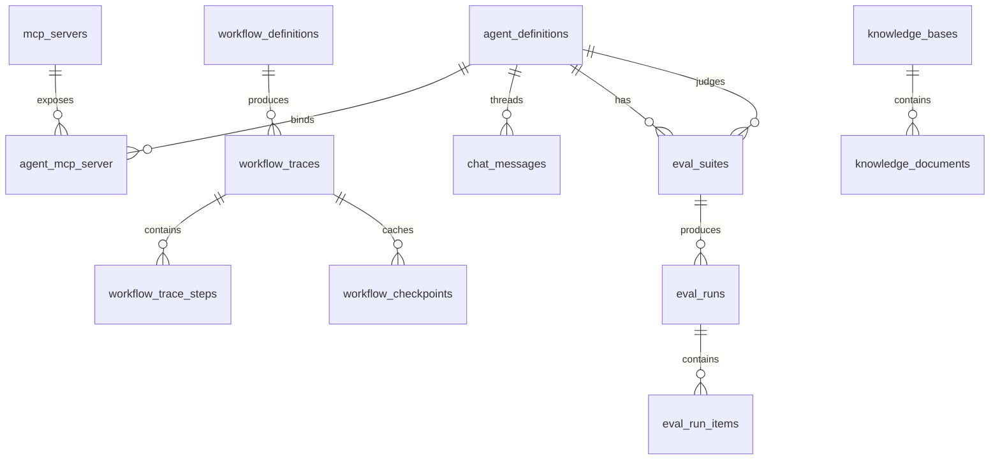

# Database Schema

NeuronAI Studio stores definitions and runtime data in prefixed database tables.

## Table prefix

Default: `neuronai_studio_`

Configure with `NEURONAI_STUDIO_TABLE_PREFIX`.

## Tables

| Table | Purpose |
|-------|---------|
| `agent_definitions` | Agent name, provider, model, instructions, tool bindings |
| `workflow_definitions` | Workflow name, graph JSON, code source metadata |
| `tool_definitions` | Builder and webhook tool configs |
| `mcp_servers` | MCP server transport configuration |
| `agent_mcp_server` | Agent ↔ MCP server pivot with filters |
| `workflow_traces` | Workflow execution records |
| `workflow_trace_steps` | Per-step input/output timeline |
| `workflow_checkpoints` | Opt-in per-node result cache and native workflow interrupts |
| `chat_messages` | Persisted agent playground messages |
| `eval_suites` | Agent evaluation datasets and judge config |
| `eval_runs` | Evaluation execution records |
| `eval_run_items` | Per-case results (input, output, pass/fail) |
| `knowledge_bases` | RAG knowledge base metadata (embeddings, vector store, retrieval defaults) |
| `knowledge_documents` | Ingested documents per knowledge base (status, chunk count, storage key) |

## Entity relationships



## Key columns

### agent_definitions

- `slug` — unique identifier, used in templates and exports
- `provider`, `model` — LLM configuration
- `instructions` — system prompt
- `tools` — JSON tool binding array

### workflow_definitions

- `graph` — JSON canvas (nodes, edges, viewport)
- `code_source` — optional PHP class reference for imported workflows

### workflow_traces

- `status` — running, completed, failed, awaiting_input, awaiting_tool_approval
- `checkpoint` — serialized state for HITL / tool-approval / parallel-branch resume

### workflow_checkpoints

Backs two features:

- **Node checkpoints** (`data.checkpoint: true`) — cache an expensive node's state change so a
  resumed run skips re-execution.
- **Native workflow interrupts** — `EloquentPersistence` stores serialized NeuronAI
  `WorkflowInterrupt` payloads for exported/native workflows.

Columns:

- `workflow_trace_id` — nullable FK to `workflow_traces` (null for native workflows), cascade delete
- `workflow_key` — identifies native workflow checkpoints (nullable)
- `node_id`, `iteration` — scope a checkpoint to a node and (for loops) an iteration
- `input_hash` — `sha256` of the node's input state; a change invalidates the cache
- `state_payload` — JSON state change (node checkpoint) or serialized interrupt (native)
- `expires_at` — TTL expiry; purged by `neuronai-studio:checkpoints:purge`
- Unique on (`workflow_trace_id`, `node_id`, `iteration`)

### eval_suites

- `agent_definition_id` — agent under test
- `judge_agent_definition_id` — optional Studio agent used as AI judge
- `slug` — unique per agent
- `dataset` — JSON array of test cases (`input`, `reference`, `context`, `_assertions`, `tool`)
- `judge_config` — deprecated inline judge provider/model/instructions (prefer `judge_agent_definition_id`)

### knowledge_bases

- `slug` — unique identifier
- `embeddings_provider`, `embeddings_model` — embedding configuration
- `vector_store_driver`, `vector_store_config` — vector store selection and options
- `retrieval_defaults` — JSON with default `top_k` and `threshold`

### knowledge_documents

- `knowledge_base_id` — parent knowledge base (cascade delete)
- `source_type` — `upload` or `text`
- `storage_key` — path on configured disk for uploaded files
- `status` — `pending`, `processing`, `ready`, `failed`
- `chunk_count` — number of indexed chunks after ingest

### eval_runs

- `status` — running, completed, failed
- `passed_count`, `failed_count`, `success_rate` — aggregated from `EvaluatorSummary`
- `provider`, `model` — snapshot of agent under test at run time
- `judge_agent_definition_id`, `judge_provider`, `judge_model` — snapshot of judge agent at run time

### eval_run_items

- `case_index` — dataset item index
- `input`, `output` — case data
- `passed` — boolean result
- `failures`, `scores` — JSON from NeuronAI assertion results

## Migrations

Migrations load automatically from the package. Publish only if you need to modify them:

```bash
php artisan vendor:publish --tag=neuronai-studio-migrations
```

## Related code

- `src/Support/StudioTables.php` — table name helper
- `database/migrations/` — migration files
