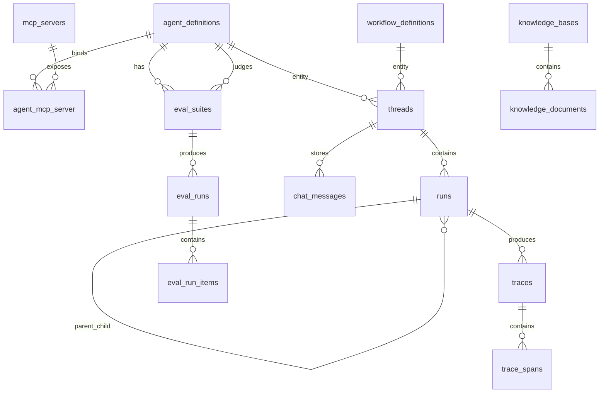

# Database Schema

NeuronAI Studio stores definitions and runtime data in prefixed database tables.

## Table prefix

Default: `neuronai_studio_`

Configure with `NEURONAI_STUDIO_TABLE_PREFIX`.

## Tables

| Table | Purpose |
|-------|---------|
| `agent_definitions` | Agent name, provider, model, instructions, tool bindings |
| `workflow_definitions` | Workflow name, graph JSON, code source metadata |
| `tool_definitions` | Builder and webhook tool configs |
| `mcp_servers` | MCP server transport configuration |
| `agent_mcp_server` | Agent ↔ MCP server pivot with filters |
| `threads` | Conversation / execution threads (polymorphic entity) |
| `runs` | Unified execution records (agent or workflow) |
| `traces` | Observability root per run |
| `trace_spans` | Node / LLM / tool spans under a trace |
| `chat_messages` | Persisted playground / thread chat history |
| `eval_suites` | Agent evaluation datasets and judge config |
| `eval_runs` | Evaluation execution records |
| `eval_run_items` | Per-case results (input, output, pass/fail) |
| `knowledge_bases` | RAG knowledge base metadata |
| `knowledge_documents` | Ingested documents per knowledge base |

> **Note:** Legacy `workflow_traces` / `workflow_trace_steps` / `workflow_checkpoints` tables were replaced by the unified `threads` → `runs` → `traces` → `trace_spans` model. Node checkpoints live in `runs.checkpoint_state`.

## Entity relationships



## Key columns

### agent_definitions

- `slug` — unique identifier, used in templates and exports
- `provider`, `model` — LLM configuration
- `instructions` — system prompt
- `tools` — JSON tool binding array
- `require_tool_approval` — pause before tool execution when true
- `memory_config` — JSON envelope: `context_window`, `driver` (`eloquent`|`in_memory`), `summarization_enabled`, `summarization_threshold`, plus reserved budget keys for context engineering. Null = inherit global defaults.
- `tool_max_runs`, `parallel_tool_calls` — optional tool-loop knobs

### workflow_definitions

- `graph` — JSON canvas (nodes, edges, viewport)
- `code_source` / `class_path` — optional PHP class reference for imported workflows

### threads

- `id` — UUID (public thread id for playground / integrate)
- `entity_type`, `entity_id` — owning agent or workflow definition (nullable)

### runs

- `thread_id` — FK → `threads`
- `parent_run_id` — nullable FK → `runs` (nested agent/LLM work under a workflow run)
- `status` — `running`, `completed`, `failed`, `awaiting_input`, `awaiting_tool_approval`, …
- `input`, `output` — JSON payloads
- `checkpoint_state` — HITL / tool-approval / parallel resume + node checkpoint cache
- `prompt_tokens`, `completion_tokens`, `total_tokens` — aggregated usage
- `estimated_cost` — `decimal(12,6)` estimated spend (install currency)
- `error_message`, `started_at`, `finished_at`

Indexes include `parent_run_id` and `started_at` for nested rollups and time-window queries.

### traces

- `run_id` — FK → `runs` (cascade delete)

### trace_spans

- `trace_id` — FK → `traces`
- `parent_span_id` — optional span hierarchy
- `name`, `type` — e.g. node name / `llm` / `tool` / `node` / `memory` (`history_compaction`)
- `output` — JSON; for compaction spans includes `mode`, `trimmed_count`, `summarizer_source` / `summarizer_fallback`, token estimates
- `status` — running, completed, failed
- `provider`, `model` — LLM attribution (nullable when unknown)
- `prompt_tokens`, `completion_tokens`, `total_tokens`
- `estimated_cost` — `decimal(12,6)` for priced LLM spans (0 when unpriced)
- `input`, `output`, `duration_ms`, `error_message`, `started_at`, `finished_at`

### chat_messages

- `thread_id` — UUID thread key (no FK; matches playground / integrate ids)
- `role`, `content`, `meta` — summary/compaction messages use `role=system` with `meta.studio_kind=summary` and content prefixed `[Studio memory summary]`

### eval_suites

- `agent_definition_id` — agent under test
- `judge_agent_definition_id` — optional Studio agent used as AI judge
- `slug` — unique per agent
- `dataset` — JSON array of test cases (`input`, `reference`, `context`, `_assertions`, `tool`)
- `judge_config` — deprecated inline judge provider/model/instructions (prefer `judge_agent_definition_id`)

### knowledge_bases

- `slug` — unique identifier
- `embeddings_provider`, `embeddings_model` — embedding configuration
- `vector_store_driver`, `vector_store_config` — vector store selection and options
- `retrieval_defaults` — JSON with default `top_k` and `threshold`

### knowledge_documents

- `knowledge_base_id` — parent knowledge base (cascade delete)
- `source_type` — `upload` or `text`
- `storage_key` — path on configured disk for uploaded files
- `status` — `pending`, `processing`, `ready`, `failed`
- `chunk_count` — number of indexed chunks after ingest

### eval_runs

- `status` — running, completed, failed
- `passed_count`, `failed_count`, `success_rate` — aggregated from `EvaluatorSummary`
- `provider`, `model` — snapshot of agent under test at run time
- `judge_agent_definition_id`, `judge_provider`, `judge_model` — snapshot of judge agent at run time

### eval_run_items

- `case_index` — dataset item index
- `input`, `output` — case data
- `passed` — boolean result
- `failures`, `scores` — JSON from NeuronAI assertion results

## Migrations

Migrations load automatically from the package. Publish only if you need to modify them:

```bash
php artisan vendor:publish --tag=neuronai-studio-migrations
```

Relevant migrations for runtime telemetry:

- `…_create_studio_runs_and_traces_tables` — `threads`, `runs`, `traces`, `trace_spans`
- `…_add_usage_cost_columns_to_runs_and_spans` — `provider` / `model` / `estimated_cost` / `parent_run_id`

## Related code

- `src/Support/StudioTables.php` — table name helper
- `src/Models/StudioRun.php`, `StudioTrace.php`, `StudioTraceSpan.php`, `StudioThread.php`
- `src/Usage/UsageRecorder.php` — LLM span persist + run finalize
- `database/migrations/` — migration files

## See also

- [Cost estimation](../guides/analytics/costs.md)
- [Runtime & Traces](../guides/workflows/runtime-and-traces.md)
