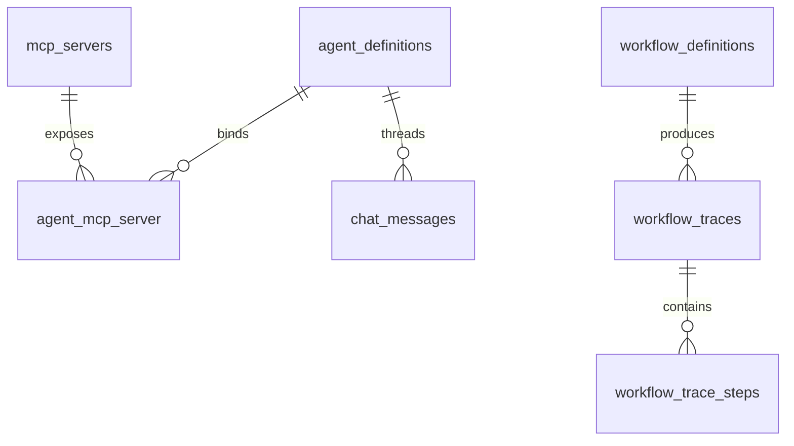

# Database Schema

NeuronAI Studio stores definitions and runtime data in prefixed database tables.

## Table prefix

Default: `neuronai_studio_`

Configure with `NEURONAI_STUDIO_TABLE_PREFIX`.

## Tables

| Table | Purpose |
|-------|---------|
| `agent_definitions` | Agent name, provider, model, instructions, tool bindings |
| `workflow_definitions` | Workflow name, graph JSON, code source metadata |
| `tool_definitions` | Builder and webhook tool configs |
| `mcp_servers` | MCP server transport configuration |
| `agent_mcp_server` | Agent ↔ MCP server pivot with filters |
| `workflow_traces` | Workflow execution records |
| `workflow_trace_steps` | Per-step input/output timeline |
| `chat_messages` | Persisted agent playground messages |
| `eval_*` | Evaluation datasets and runs (when enabled) |

## Entity relationships



## Key columns

### agent_definitions

- `slug` — unique identifier, used in templates and exports
- `provider`, `model` — LLM configuration
- `instructions` — system prompt
- `tools` — JSON tool binding array

### workflow_definitions

- `graph` — JSON canvas (nodes, edges, viewport)
- `code_source` — optional PHP class reference for imported workflows

### workflow_traces

- `status` — running, completed, failed, waiting_for_human
- `checkpoint` — serialized state for HITL resume

## Migrations

Migrations load automatically from the package. Publish only if you need to modify them:

```bash
php artisan vendor:publish --tag=neuronai-studio-migrations
```

## Related code

- `src/Support/StudioTables.php` — table name helper
- `database/migrations/` — migration files
