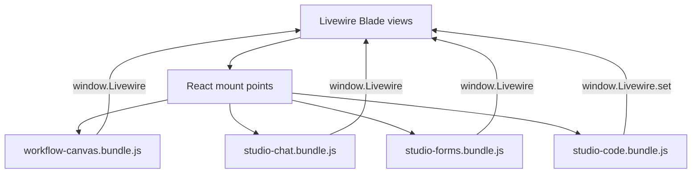

# Frontend Bundles

NeuronAI Studio ships five Vite-built JavaScript/CSS bundles served from `public/vendor/neuronai-studio/`.

## Bundles

| Bundle | Entry | Purpose |
|--------|-------|---------|
| `studio-ui.css` | `resources/css/studio-ui.css` | Global studio styles |
| `workflow-canvas.bundle.js` | `resources/js/studio-canvas/main.jsx` | Workflow graph editor (React Flow) |
| `studio-chat.bundle.js` | `resources/js/studio-chat/main.jsx` | Chat, playground, workflow test harness |
| `studio-forms.bundle.js` | `resources/js/studio-forms/main.jsx` | Agent and tool forms |
| `studio-code.bundle.js` | `resources/js/studio-code/main.jsx` | CodeMirror editors for Livewire pages (Evals JSON) |

Trace viewer components live in `resources/js/studio-traces/` and load separately.

Shared CodeMirror components live in `resources/js/components/code/` and are imported by both `workflow-canvas.bundle.js` and `studio-code.bundle.js`.

## Architecture



React components communicate with Livewire via `window.Livewire.find(componentId).call(method, ...args)`.

Livewire code editors sync via `window.Livewire.find(wireId).set(field, value)` on each change.

## Code editor API

The `studio-code` bundle exposes `window.NeuronStudioCode`:

| Method | Description |
|--------|-------------|
| `mountEditor(el, options?)` | Mount an editable CodeMirror instance with Livewire sync |
| `mountViewer(el, options?)` | Mount a read-only CodeMirror viewer |

Auto-mount: elements with `data-neuron-code-editor` are mounted on `DOMContentLoaded` and `livewire:navigated`.

Options (via `data-*` attributes or second argument):

| Option | Attribute | Default |
|--------|-----------|---------|
| `wireId` | `data-wire-id` | — |
| `field` | `data-field` | — |
| `language` | `data-language` | `json` |
| `minHeight` | `data-min-height` | `384px` |
| `readOnly` | `data-read-only="true"` | `false` |

Initial value for Livewire pages can be passed via `window.__NEURONAI_CODE_EDITORS[elementId] = { value: ... }`.

## Build

From the package root:

```bash
npm install
npm run build
php artisan vendor:publish --tag=neuronai-studio-assets --force
```

Pre-built bundles ship in `resources/js/dist/` — consumers do not need Node.js unless customizing the UI.

## Directory structure

```
resources/js/
├── components/code/   # Shared CodeMirror components
│   ├── CodeEditor.jsx
│   ├── CodeViewer.jsx
│   └── extensions.js
├── studio-canvas/     # Workflow editor
│   ├── WorkflowCanvas.jsx
│   ├── inspector/
│   └── main.jsx
├── studio-chat/       # Chat & test harness
│   ├── StudioChat.jsx
│   ├── adapters/
│   └── main.jsx
├── studio-code/       # Livewire code editor mounts
│   └── main.jsx
├── studio-forms/      # Agent & tool forms
│   ├── AgentForm.jsx
│   ├── ToolBuilder.jsx
│   └── main.jsx
└── studio-traces/     # Trace viewer
```

## Customizing the UI

1. Fork or path-repo the package
2. Edit React components
3. Run `npm run build`
4. Republish assets

See [Contributing to Studio UI](../extending/contributing-to-studio-ui.md).

## See also

- [Publish Tags](publish-tags.md)
- [Canvas Editor](../guides/workflows/canvas-editor.md)
