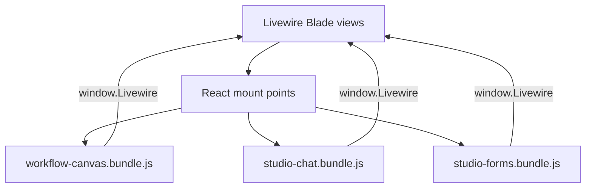

# Frontend Bundles

NeuronAI Studio ships four Vite-built JavaScript/CSS bundles served from `public/vendor/neuronai-studio/`.

## Bundles

| Bundle | Entry | Purpose |
|--------|-------|---------|
| `studio-ui.css` | `resources/css/studio-ui.css` | Global studio styles |
| `workflow-canvas.bundle.js` | `resources/js/studio-canvas/main.jsx` | Workflow graph editor (React Flow) |
| `studio-chat.bundle.js` | `resources/js/studio-chat/main.jsx` | Chat, playground, workflow test harness |
| `studio-forms.bundle.js` | `resources/js/studio-forms/main.jsx` | Agent and tool forms |

Trace viewer components live in `resources/js/studio-traces/` and load separately.

## Architecture



React components communicate with Livewire via `window.Livewire.find(componentId).call(method, ...args)`.

## Build

From the package root:

```bash
npm install
npm run build
php artisan vendor:publish --tag=neuronai-studio-assets --force
```

Pre-built bundles ship in `resources/js/dist/` — consumers do not need Node.js unless customizing the UI.

## Directory structure

```
resources/js/
├── studio-canvas/     # Workflow editor
│   ├── WorkflowCanvas.jsx
│   ├── inspector/
│   └── main.jsx
├── studio-chat/       # Chat & test harness
│   ├── StudioChat.jsx
│   ├── adapters/
│   └── main.jsx
├── studio-forms/      # Agent & tool forms
│   ├── AgentForm.jsx
│   ├── ToolBuilder.jsx
│   └── main.jsx
└── studio-traces/     # Trace viewer
```

## Customizing the UI

1. Fork or path-repo the package
2. Edit React components
3. Run `npm run build`
4. Republish assets

See [Contributing to Studio UI](../extending/contributing-to-studio-ui.md).

## See also

- [Publish Tags](publish-tags.md)
- [Canvas Editor](../guides/workflows/canvas-editor.md)
